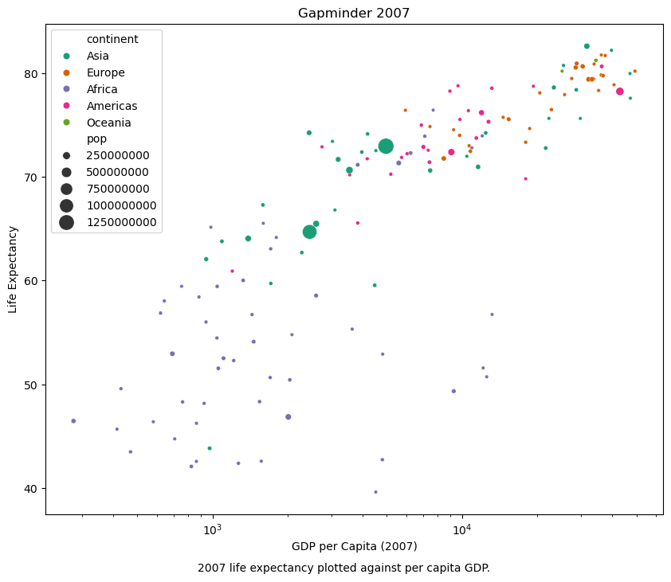
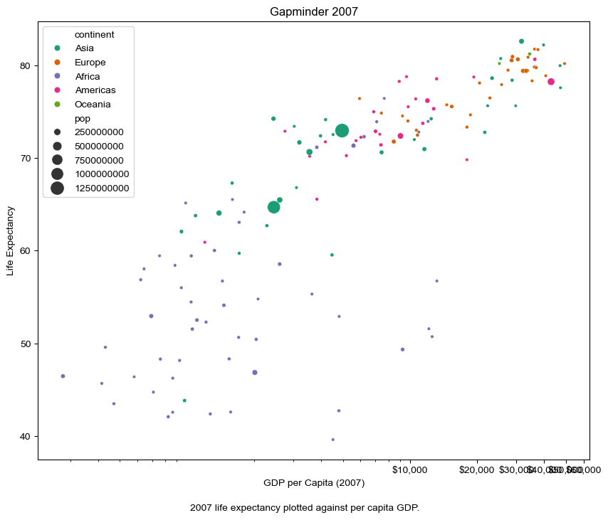

## Exploratory Data Anaysis

Let's import our library and data set.


```python
#import all libraries required for this data.
import pandas as pd
import numpy as np
import matplotlib.pyplot as plt
import seaborn as sns
```


```python
# Reading CSV files from GitHub
gapminder = pd.read_csv('https://raw.githubusercontent.com/csc-ubc-okanagan/workshops/a091bc6eae8b9045866c28dbd1848c7e072db5b1/data/gapminder.csv')
gapminder_nas = pd.read_csv('https://raw.githubusercontent.com/csc-ubc-okanagan/workshops/a091bc6eae8b9045866c28dbd1848c7e072db5b1/data/gapminder_nas.csv')

# Reading Excel file from GitHub
gapminder_xlsx = pd.read_excel('https://raw.githubusercontent.com/csc-ubc-okanagan/workshops/a091bc6eae8b9045866c28dbd1848c7e072db5b1/data/gapminder.xlsx', engine='openpyxl')
# Exporting CSV files
gapminder.to_csv('gapminder.csv', index=False)
gapminder_nas.to_csv('gapminder_nas.csv', index=False)

# Exporting Excel file
gapminder_xlsx.to_excel('gapminder.xlsx', index=False, engine='openpyxl')
```

### Handling Missing Values with Pandas

Datasets often have missing or placeholder values. Pandas, a Python data manipulation library, offers tools to address this. Using the na_values parameter when reading a dataset, like "gapminder_nas.csv", enables Pandas to recognize placeholders such as "NA", "NULL", or empty spaces, and treat them as NaN. This simplifies subsequent data cleaning and analysis.


```python
# Assuming you've read in the data
na_values = ["NA", "NULL", "", " "]
data_gapminder = pd.read_csv("gapminder_nas.csv", na_values=na_values)
```


```python
data_gapminder.head()
```


<div>
<style scoped>
    .dataframe tbody tr th:only-of-type {
        vertical-align: middle;
    }

    .dataframe tbody tr th {
        vertical-align: top;
    }

    .dataframe thead th {
        text-align: right;
    }
</style>
<table border="1" class="dataframe">
  <thead>
    <tr style="text-align: right;">
      <th></th>
      <th>country</th>
      <th>continent</th>
      <th>year</th>
      <th>lifeExp</th>
      <th>pop</th>
      <th>gdpPercap</th>
    </tr>
  </thead>
  <tbody>
    <tr>
      <th>0</th>
      <td>Afghanistan</td>
      <td>Asia</td>
      <td>1952.0</td>
      <td>NaN</td>
      <td>8425333.0</td>
      <td>779.445314</td>
    </tr>
    <tr>
      <th>1</th>
      <td>Afghanistan</td>
      <td>Asia</td>
      <td>1957.0</td>
      <td>30.332</td>
      <td>9240934.0</td>
      <td>820.853030</td>
    </tr>
    <tr>
      <th>2</th>
      <td>Afghanistan</td>
      <td>Asia</td>
      <td>1962.0</td>
      <td>31.997</td>
      <td>10267083.0</td>
      <td>853.100710</td>
    </tr>
    <tr>
      <th>3</th>
      <td>Afghanistan</td>
      <td>Asia</td>
      <td>1967.0</td>
      <td>34.020</td>
      <td>11537966.0</td>
      <td>836.197138</td>
    </tr>
    <tr>
      <th>4</th>
      <td>Afghanistan</td>
      <td>Asia</td>
      <td>1972.0</td>
      <td>36.088</td>
      <td>13079460.0</td>
      <td>739.981106</td>
    </tr>
  </tbody>
</table>
</div>


### Checking for Missing Values
Now we will determine if there are any missing values in the 'pop' column of the data_gapminder dataframe. The isna() function is used to create a boolean series, missing_pop, where True denotes a missing value and False signifies a present value. By displaying the first few entries with head() and summing up the True values, we can gain a quick insight into both the presence and the total count of missing values in that column.


```python
data_gapminder.info()
```

    <class 'pandas.core.frame.DataFrame'>
    RangeIndex: 1704 entries, 0 to 1703
    Data columns (total 6 columns):
     #   Column     Non-Null Count  Dtype  
    ---  ------     --------------  -----  
     0   country    1704 non-null   object
     1   continent  1704 non-null   object
     2   year       1487 non-null   float64
     3   lifeExp    1512 non-null   float64
     4   pop        1481 non-null   float64
     5   gdpPercap  1485 non-null   float64
    dtypes: float64(4), object(2)
    memory usage: 80.0+ KB


```python
# Missing Values
missing_pop = data_gapminder['pop'].isna()
print(missing_pop.head())
print(sum(missing_pop))
```

    0    False
    1    False
    2    False
    3    False
    4    False
    Name: pop, dtype: bool
    223


### Filter missing values
Now let's filter the data_gapminder dataframe to retain only the rows that have no missing values across all columns. This is accomplished using the dropna() method, which removes any row containing a NaN value. The result will be stored in the complete_gapminder dataframe. By printing the length of this filtered dataframe, we can determine the number of complete cases, i.e., rows without any missing values, in our dataset.


```python
# Complete Cases
complete_gapminder = data_gapminder.dropna()
print(len(complete_gapminder))
```

    853


### Quick Descriptive Statistics

* The total number of entries in the 'country' column.


```python
# Descriptive Statistics
# Number of Observations
print(len(data_gapminder['country']))
```

    1704


### Dimentions of dataset
* The overall dimensions of the dataframe, indicating the number of rows and columns.


```python
print(data_gapminder.shape)  # (number of rows, number of columns)
```

    (1704, 6)


### Minimum and Maximum
* Display the minimum and maximum values of the 'year' column in the data_gapminder dataframe, effectively showing the range of years covered by the dataset.


```python
#describe the following # Range
print(data_gapminder['year'].min())
print(data_gapminder['year'].max())
```

    1952.0
    2007.0


### Mean and Median
* Calculate and print the average (mean) value for the 'lifeExp' (life expectancy) column and the median (middle) value for the 'gdpPercap' (GDP per capita) column in the data_gapminder dataframe.


```python
# Mean & Median
print(data_gapminder['lifeExp'].mean())
print(data_gapminder['gdpPercap'].median())
```

    58.902098095238095
    3242.531147


### Variance and Standard Deviation
* Calcualte and display the **variance and standard deviation** for the 'lifeExp' (life expectancy) column in the data_gapminder dataframe. Variance measures how spread out the numbers in a dataset are, while the standard deviation indicates the average amount the values deviate from the mean.


```python
# Variance and Standard Deviation
print(data_gapminder['lifeExp'].var())
print(data_gapminder['lifeExp'].std())
```

    165.1612971475914
    12.851509527973413


### Quantiles
* Calcualte and display the **quantiles** for the 'gdpPercap' (GDP per capita) column in the data_gapminder dataframe. Specifically, calculate the minimum (0% quantile), first quartile (25% quantile), median (50% quantile), third quartile (75% quantile), and maximum (100% quantile) values, providing insights into the data's distribution and spread.


```python
# Quantiles
print(data_gapminder['gdpPercap'].quantile([0, 0.25, 0.5, 0.75, 1]))
```

    0.00       241.165876
    0.25      1147.388831
    0.50      3242.531147
    0.75      8533.088805
    1.00    113523.132900
    Name: gdpPercap, dtype: float64


### Statistical Summary

Now let's create **statistical summary** for the 'gdpPercap' column and the entire data_gapminder dataframe.

For the 'gdpPercap' column, it presents metrics like count, mean, standard deviation, minimum, 25th percentile, median, 75th percentile, and maximum.
For the entire dataframe, it provides a similar statistical breakdown for all numerical columns, giving a comprehensive view of the dataset's characteristics.


```python
# Summaries
print(data_gapminder['gdpPercap'].describe())
print(data_gapminder.describe())
```

    count      1485.000000
    mean       6839.475803
    std        9686.630785
    min         241.165876
    25%        1147.388831
    50%        3242.531147
    75%        8533.088805
    max      113523.132900
    Name: gdpPercap, dtype: float64
                  year      lifeExp           pop      gdpPercap
    count  1487.000000  1512.000000  1.481000e+03    1485.000000
    mean   1979.162071    58.902098  2.835264e+07    6839.475803
    std      17.265521    12.851510  1.033339e+08    9686.630785
    min    1952.000000    23.599000  6.001100e+04     241.165876
    25%    1962.000000    47.831750  2.736300e+06    1147.388831
    50%    1977.000000    59.625500  6.702668e+06    3242.531147
    75%    1992.000000    70.596500  1.835666e+07    8533.088805
    max    2007.000000    82.603000  1.318683e+09  113523.132900


### Visualizing Data Distributions: Histogram

* Visualizes the distribution of the 'gdpPercap' column from the data_gapminder dataframe using a histogram. A histogram is a graphical representation that groups a dataset into bins and displays the frequency of data points within each bin. By executing this code, we will see a plot that offers insights into the spread and central tendencies of the GDP per capita values in the dataset.


```python
# Visualizing Distributions
# Histograms
data_gapminder['gdpPercap'].hist()
plt.show()
```


Now let's display a histogram of the 'gdpPercap' column from the data_gapminder dataframe with 30 bins, visualizing the distribution of GDP per capita values across these bins.


```python
data_gapminder['gdpPercap'].hist(bins=30)
plt.show()
```





### Density Plot
We can also generate a smooth density plot, visualizing the distribution of the 'lifeExp' column from the data_gapminder dataframe.


```python
# Density Plots
data_gapminder['lifeExp'].plot(kind='density')
plt.show()
```


### Boxplot

In the following code we will display a box plot comparing the distribution of 'lifeExp' values grouped by different 'continent' categories in the data_gapminder dataframe.


```python
# Box Plots
data_gapminder.boxplot(column='lifeExp', by='continent')
plt.show()
```





### Scatter plots

Finally, we will generate two scatter plots:
1. The first scatter plot visualizes the relationship between 'gdpPercap' and 'lifeExp' in the data_gapminder dataframe.
2. The second scatter plot does the same but with the 'gdpPercap' values log-transformed, allowing for clearer visualization of data spanning several orders of magnitude.


```python
# Scatter Plots
data_gapminder.plot(x='gdpPercap', y='lifeExp', kind='scatter')
plt.show()

```


* Caculate the natural logarithm of the gdpPercap column in the data_gapminder DataFrame and stores the result in a new column named log_gdpPercap. Then, plot a scatterplot comparing this log-transformed GDP per capita against life expectancy (lifeExp).


```python
plt.scatter(x=np.log(data_gapminder['gdpPercap']), y=data_gapminder['lifeExp'])
plt.show()
```


# References

## Gapminder Dataset
- [Gapminder](https://www.gapminder.org)

## Python
- [Official Python Documentation](https://docs.python.org/3/)

## NumPy
- [NumPy Official Website](https://numpy.org/)

## Pandas
- [Pandas Official Documentation](https://pandas.pydata.org/)

## Seaborn
- [Seaborn Official Website](https://seaborn.pydata.org/)

## Matplotlib
- [Matplotlib Official Website](https://matplotlib.org/)


```python

```
