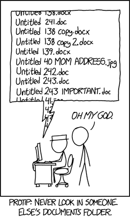
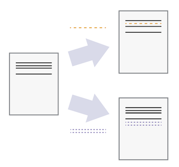
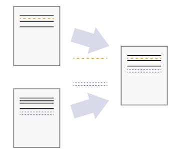
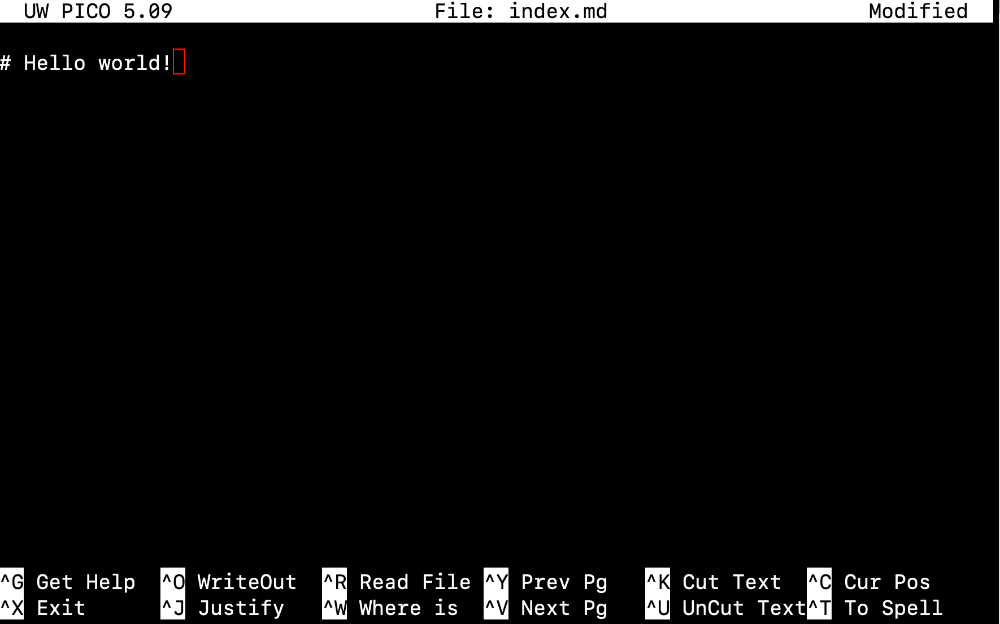

# Introduction to Git and GitHub Part 1

Last Updated: 2023-11-07

> In order to proceed with this lesson, if you have not already done so, you will need to [install git on your computer](https://docs.github.com/en/get-started/quickstart/set-up-git).

## What is Version Control?

Before we jump into GitHub, it's worth first having a discussion about version control. I'm sure all of us are familiar with a situation where a file's versioning has grown out of control:



[Source: https://xkcd.com/1459/](https://xkcd.com/1459/)


Version control software, or systems, are useful ways to record changes you make to a file, helping to avoid falling into the pits of having numerous nearly identical files. Things like Microsoft Word's 'Track Changes', or Google Doc's 'Version History' are examples of automated version control systems.

Version control systems begin with a base version of a document, and then record changes you make each step of the way.  You can start making additions to the document, and then can rewind to the base of the document to review each change you made, eventually arriving at your most recent version.


[Source: https://swcarpentry.github.io/git-novice/01-basics.html](https://swcarpentry.github.io/git-novice/01-basics.html)

### Version Control with Multiple Editors

Once you think of changes as separate from the document itself, you can then think about “playing back” different sets of changes on the base document, ultimately resulting in different versions of that document. For example, two users can make independent sets of changes on the same document, progressing forward to a new version.



[Source: https://swcarpentry.github.io/git-novice/01-basics.html](https://swcarpentry.github.io/git-novice/01-basics.html)


Unless multiple users make changes to the same section of the document - considered a 'conflict' - you can incorporate two sets of changes into the same base document.




[Source: https://swcarpentry.github.io/git-novice/01-basics.html](https://swcarpentry.github.io/git-novice/01-basics.html)


### Benefits of Using Version Control

**Collaboration**: Version control allows us to define formalized ways we can work together and share writing and code. For example, merging together sets of changes from different parties enables co-creation of documents and software across distributed teams.

**Versioning**: Having a robust and rigorous log of changes to a file, without renaming files (eg, v1, v2, final_copy)

**Testing**: Version control systems generally allow you to make changes to a local copy of a file, and test the change, before merging those changes with a shared copy.

**Rolling Back**: Version control allows us to quickly undo a set of changes. This can be useful when new edits or additions to a file introduces problems.

**Understanding**: Version control can help you understand how the code or writing came to be, who wrote or contributed particular parts, and who you might ask to help understand it better.

**Backup**: Version control systems generally imply that your code and writing can be stored on multiple other computers.

## Git and GitHub

We often hear the terms *Git* and *GitHub* used interchangeably, but they are slightly different things.

### Git

Git is one of the most widely used version control systems in the world. It is a free, open source tool that can be downloaded to your local machine and used for logging all changes made to a group of designated computer files (referred to as a “git repository” or “repo” for short) over time. It can be used to control file versions locally by you alone on your computer, but is perhaps most powerful when employed to coordinate simultaneous work on a group of files shared among distributed groups of people.


```bash
ls -a
```


```bash
.
..
.git
readme.md
```

*The output of a git repository - note the `.git` object, this is the database of tracked changes.*

Git was originally developed to help software developers work collaboratively on software projects, but it can be and is used for managing revisions to any plain text file, including markdown and LaTex documents, or spreadsheets stored as comma or tab separated values.

Git cannot version control document types that have special formatting or complex structures, such as Word documents and PDFs, though both file types can be stored in Git repositories.

Once installed, interaction with Git is generally done through a terminal using a shell. A suitable shell is included by default in Mac and Linux. When installing Git on Windows, the install will include the Git Bash shell. 

### GitHub

GitHub on the other hand is a popular website for hosting and sharing Git repositories remotely. It offers a web interface and provides functionality and a mixture of both free and paid services for working with such repositories. The majority of the content that GitHub hosts is open source software, though increasingly it is being used for other projects such as open access journals (e.g. [Journal of Open Source Software](https://joss.theoj.org/)), blogs, and regularly updated text books.

## Getting Started with Git

### Setting up Git

When we use Git on a computer for the first time, we need to configure a few things. The basic elements of a configuration for Git are:

* Your name and email address,
* What your preferred text editor is,
* The name of your default branch (branches are an important component of Git that we will cover later).

#### name and email

To get this started, open your shell terminal window, and enter the following commands:


```bash
git config --global user.name "Your Name"
git config --global user.email "yourname@domain.name"
```

If you enter the commands correctly, the shell will merely return a command prompt and no messages. To check your work, ask Git what your configuration is, using the same command as above with the `--list` flag:


```bash
git config --list
```

The output should be something like:


```bash
user.name=Your Name
user.email=yourname@domain.name
```

#### text editor

Any text editor can be set up as the default editor for Git. 

> As covered in [Introduction to the Unix Shell Part 2](https://csc-ubc-okanagan.github.io/workshops/UNIX_pt2.html), there are many different text editors to choose from. Nano is a text editor that can be used to create and edit plain text files via the command line. For the purpose of this lesson, we are going to use Nano because it’s one of the least complex, and common across systems. As you move forward in your Unix or Linux journey, feel free to explore and play with different text editors.

To set Nano as the default editor, enter the following command:


```bash
git config --global core.editor "nano -w"
```

#### default branch name

The final thing we need to do is set the name of our default branch to *main*:


```bash
git config --global init.defaultBranch main
```

> With a basic install of Git, the default branch name is `master`, which is problematic for many reasons. We can change it to anything we'd like, but convention currently uses `main`.

## Creating a Repository

A Git **repository** is a data structure used to track changes to a set of project files over time. Repositories are stored within the same directory as these project files, in a hidden directory called `.git` (pictured earlier).

Let’s use the command line to create a git repository for the experiments that we’re going to do today. First, move to your `Desktop` directory. On most installs of Windows, MacOS, and Linux, this can be done with:


```bash
cd ~/Desktop
```

Next, we're going to create a new directory for our project and enter that directory. To do so, enter the following commands. Feel free to name your directory whatever you'd like, noting appropriate naming conventions!


```bash
mkdir my-first-repo
cd my-first-repo
```

### Using Git

On a command line interface, Git commands are written as `git + verb + options`, where `verb` is what we actually want to do and `options` are additional parameters, which may be passed to the `verb`. So let’s get started with our setup.

We will now create an empty git repository to track changes to our project. To do this we will use the `git init` command, which is simply short for initialize.


```bash
git init
```

The output from this command should be:

```
Initialized empty Git repository in {your-file-path/repository-name/.git/}
```

The `my-first-repo` (or whatever you named your directory) is now a git repository.

If we run the `ls` command with the `-a` flag to show hidden files, you'll see your new hidden directory `.git`.


```bash
ls -a
```


```bash
.
..
.git
```

> Note that whenever we use git via the command line, we need to preface each command (or verb) with `git`, so that the computer knows we are trying to get git to do something, rather than some other program.


### Displaying the Current Project's Status

You can run the `git status` command to display the current state of a project:


```bash
git status
```
At this point, the output of this command should be:


```bash
On branch main
No commits yet
nothing to commit (create/copy files and use "git add" to track)
```

The output tells us that we are on the main branch (more on this later) and that we have nothing to commit (no changes to record). Which should be reassuring, since we haven't created or edited any files yet in this directory.

### Three Steps: Save locally, Stage, Commit

We will now create and save our first project file. This is a three-step process. First, we save changes locally, then we **add** these files to a staging area - letting Git know that we're ready to track, or keep a record of, the changes we made - then we **commit** those changes to the Git repository. This process gives us fine-grained control over what should and should not be included in a particular commit.

#### create a file or save changes locally

Let's create a new file using `touch`, a quick way to create an empty file.


```bash
touch readme.md
```

> The `.md` extension above signifies that we have chosen to use the Markdown format, a lightweight markup language with plain text formatting syntax. We will explore Markdown in more depth a bit later when we built a webpage on GitHub.

Let's check the status of our project again.


```bash
git status
```

Output:


```bash
On branch main
No commits yet
Untracked files:
 (use "git add <file>..." to include in what will be committed)

readme.md
```

This status message tells us that Git has noticed a new file in our directory that we are not yet tracking.

## stage changes

To track any changes we make to readme.md, we 'stage' the file with `git add`.


```bash
git add readme.md
```

This adds our Markdown file to the **staging area** (the area where git checks for file changes). You can confirm this with `git status` again.


```bash
git status
```

Output:


```bash
On branch main
No commits yet

Changes to be committed:
 (use "git rm --cached <file>..." to unstage)

new file:   readme.md
```

This status message tells us that there is a new file being tracked, but not yet committed, or 'published'. Before making a commit, let’s add some text to the file.

Open the file `readme.md`, and enter `# Hello, world!`. The hash character indicates a header in Markdown. Now, save the file and check if Git has spotted the changes.


```bash
nano readme.md
```

This will open a window within your terminal that looks like this:



Once you have typed `# Hello world!`, click `ctrl + x`, press `Y` to confirm saving the work, and then `enter` to confirm the file name that you are saving to.

Now let's check the status again:


```bash
git status
```

Output:


```bash
On branch main

No commits yet

Changes to be committed:
 (use "git rm --cached <file>..." to unstage)

new file:   readme.md

Changes not staged for commit:
 use "git add <file>..." to update what will be committed)
 (use "git checkout -- <file>..." to discard changes in working directory)

 modified:   readme.md
```

This lets us know that the creation of the file has been staged, and that Git has indeed spotted that we've made changes to our file, but these changes have yet to be staged. So, let’s add these changes to the staging area by adding the changed file again.


```bash
git add readme.md
```

Now, assuming we're done with our edits for the time being, we are ready to **commit** our first changes. Commit is similar to ‘saving’ a file to Git. However, compared to saving, a commit provides a lot more information about the changes we have made, and this information will remain visible to us later.

`commit` requires that we add a message detailing the changes we've made to the file. To do this, we add the `-m` flag, followed by our message.


```bash
git commit -m 'Add readme.md'
```

Output:


```bash
[main (root-commit) e9e8fd3] Add readme.md
 1 file changed, 1 insertion(+)
 create mode 100644 readme.md
```

We can see that one file has changed and that we made one insertion, which was a line with the text ‘#Hello, world!’. We can also see the commit message ‘Add readme.md’, which we added by using the `-m` flag after `git commit`. The commit message is used to record a short, descriptive, and specific summary of what we did to help us remember later on without having to look at the actual changes. If we just run `git commit` without the `-m` option, Git will launch nano (or whatever other editor we configured as `core.editor`) forcing you to make a record of the committed changes.

Having made a commit, we now have a permanent record of what was changed, and git has also recorded some additional metadata: who made the commit (you!) and when the commit was made (timestamp). You are building a mini-history of your process of working with the files in this directory.

## Your Commit History

Let's make one more change to our file so that we can see exactly how Git version control is providing us with some insights into the changes made to our document. Open your document...


```bash
nano readme.md
```

And add a new line to it - something like 'Adding a new line to my document!'. As above, save the changes and exit Nano. Then add and commit your changes...


```bash
git add readme.md
git commit -m 'added a new line'
```

Let's look at the log.


```bash
git log
```

The output should look like something like the following, with changes in reverse chronological order, where each commit has a unique ID, it tells you who made the change, when they made the change, and their comment:


```bash
commit edde876c0fa5cde9fcb71ea2348a411a8b9767d0 (HEAD -> main)
Author: Mathew Vis-Dunbar <mathew.vis-dunbar@ubc.ca>
Date:   Mon Oct 30 12:48:56 2023 -0700

    added a new line

commit 1d15b302b40443e99e3dbd7f39d0d63ed0a28715
Author: Mathew Vis-Dunbar <mathew.vis-dunbar@ubc.ca>
Date:   Mon Oct 30 12:48:12 2023 -0700

    Add readme.md
```

## Branching

Branching is a powerful tool in Git. It allows you to modify your files without impacting your project until your sure that you're content with your modifications. Use cases include 'sandboxing', such as testing some code before implementing it, and reconciling merge conflicts locally before pushing to a remote repository.

To create a branch we use `git branch` followed by a name


```bash
git branch testing
```

We can then get a list of our branches


```bash
git branch
```

The output of which will be


```bash
* main
testing
```

The asterisk indicates which branch we are on. To switch between branches, we check them out


```bash
git checkout testing

Switched to branch 'testing'
```

We can start to create or modify files in the testing branch without impacting the main branch.


```bash
echo "I forgot to include this in the readme file." >> readme.md

cat readme.md
```


```bash
touch LICENCE.txt

echo "Copyright, 2023" > LICENCE.txt
```

If we run `git status` now, it should indicate that we're on `testing`, that we've modified a file we're tracking already and that we've created a new file that we're not yet tracking.


```bash
On branch testing
Changes not staged for commit:
  (use "git add <file>..." to update what will be committed)
  (use "git restore <file>..." to discard changes in working directory)
	modified:   readme.md

Untracked files:
  (use "git add <file>..." to include in what will be committed)
	LICENCE.txt

no changes added to commit (use "git add" and/or "git commit -a")
```

Let's stage and commit these.


```bash
git add *

git commit -m "update readme and add licence"
```

`git status` should now report a clean tree. And if we run `git log` we should now see that we're one step ahead of `main`.


```bash
git log

commit f576432703887adea2fae88973d6b08a9f0a8faa (HEAD -> testing)
Author: Mathew Vis-Dunbar <mathew.vis-dunbar@ubc.ca>
Date:   Mon Nov 6 08:03:27 2023 -0800

    update readme and add licence

commit c0dc399bc11048ccd39347bb496b07dfc1a1af89 (main)
Author: Mathew Vis-Dunbar <mathew.vis-dunbar@ubc.ca>
Date:   Mon Nov 6 07:51:20 2023 -0800

    add readme.md
```

We can walk away from testing for a bit if we need, and switch back to main if there's something else that we need to work on...


```bash
git checkout main

git branch

* main
testing
```

To see that what we did in `testing` didn't impact `main` we can run `ls` or `cat` on readme.md to see that nothing has changed.


```bash
ls

readme.md

cat readme

# Hello world!
```

When you're happy with the changes you've made to your project in `testing` we can merge the two branches back together. First, make sure you're back in `main`, then...


```bash
git merge testing

Updating c0dc399..f576432
Fast-forward
 LICENCE.txt | 1 +
 readme.md   | 3 ++-
 2 files changed, 3 insertions(+), 1 deletion(-)
 create mode 100644 LICENCE.txt
```

and now that we're done with `testing`, we'll delete it.


```bash
git branch -d testing

Deleted branch testing (was f576432).
```

# Ignoring Files

Git allows us to skip over certain files. These files are tracked in a special file called `.gitignore`, which we need to create.


```bash
touch .gitignore
```

We can the edit the file, adding anything we're not interested in tracking. For the purposes of demonstration, we'll create a `personal` file that we don't want shared when we share our repository, then we'll add that file to `.gitignore` with nano.


```bash
touch personal.md

nano .gitignore
```

If we run `git status` now, we'll see that git is 'unaware' of `personal.md`.


```bash
git status

On branch main
Untracked files:
  (use "git add <file>..." to include in what will be committed)
	.gitignore

nothing added to commit but untracked files present (use "git add" to track)
```
