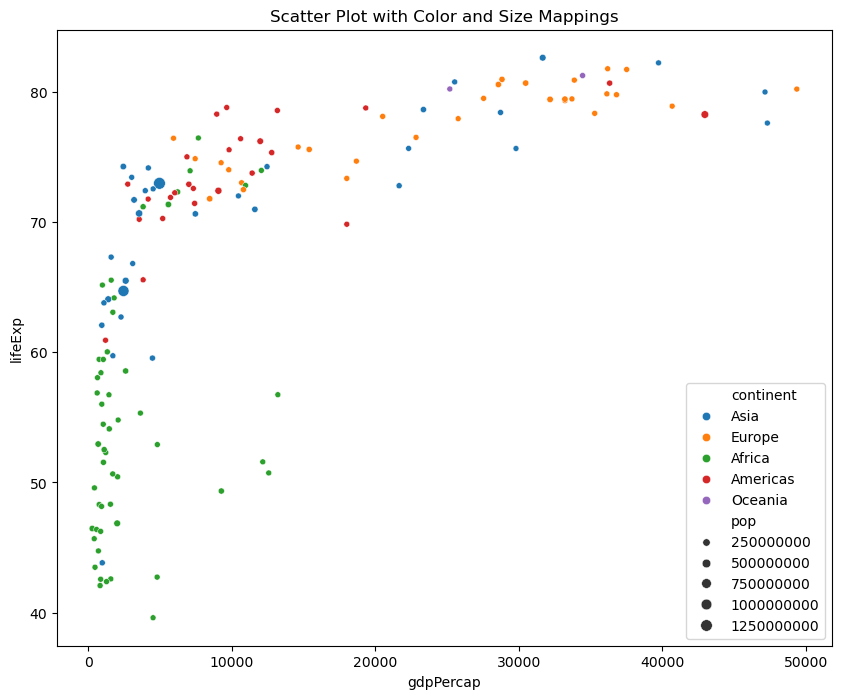
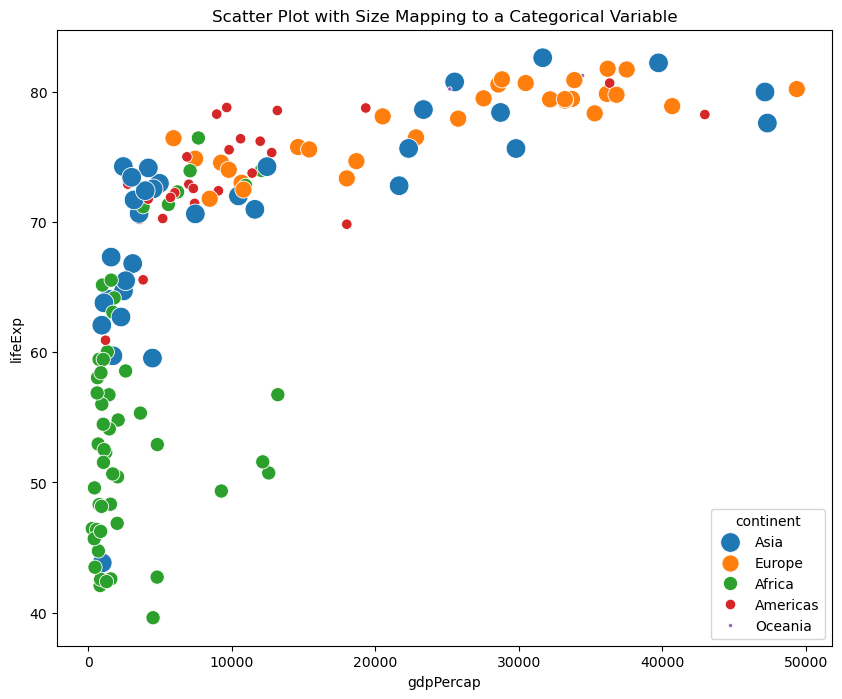
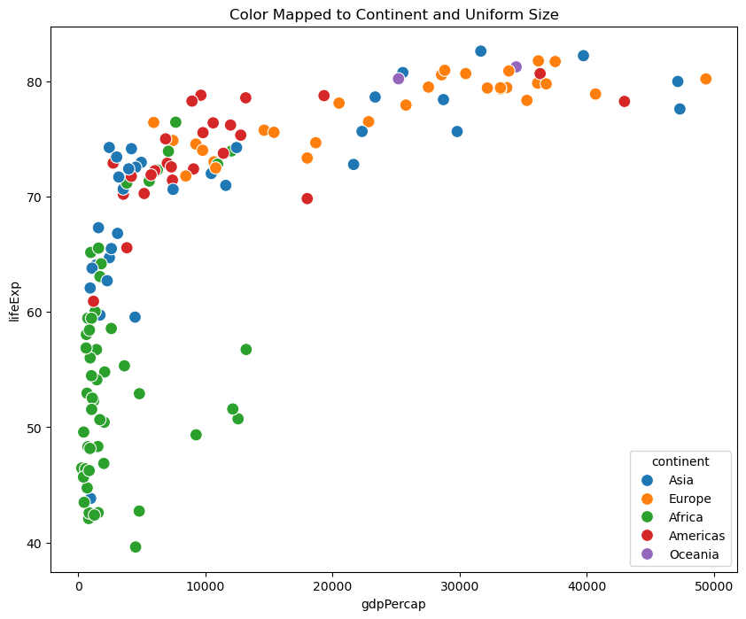
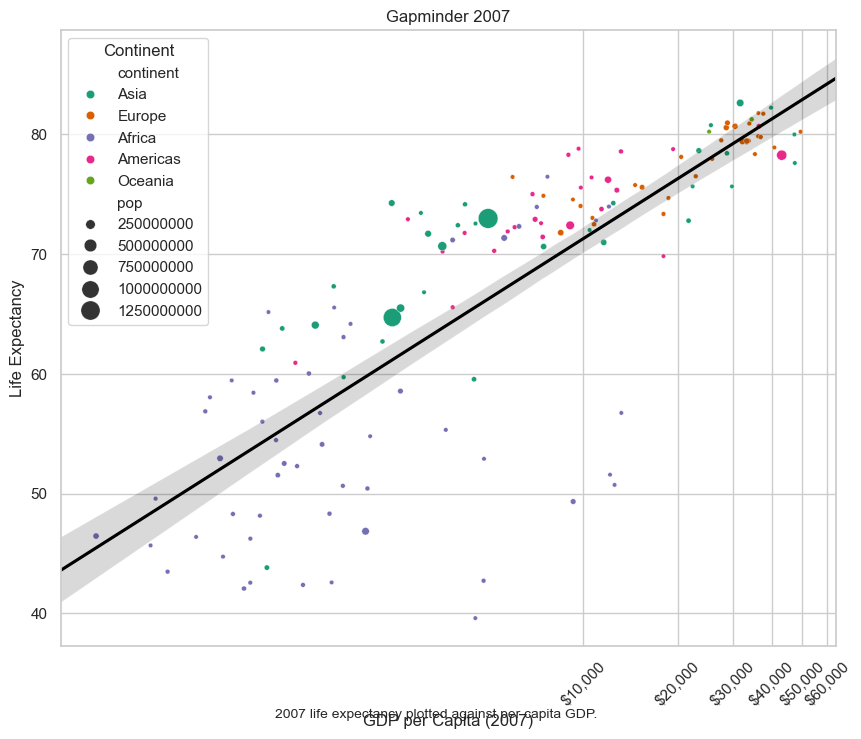
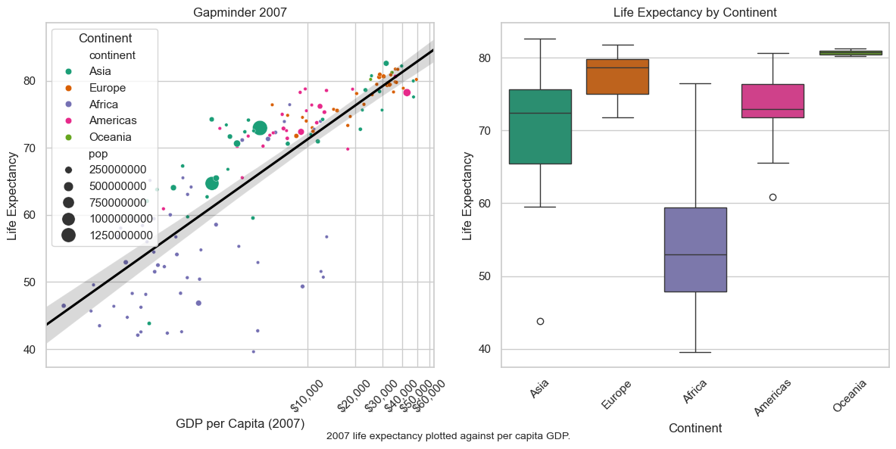
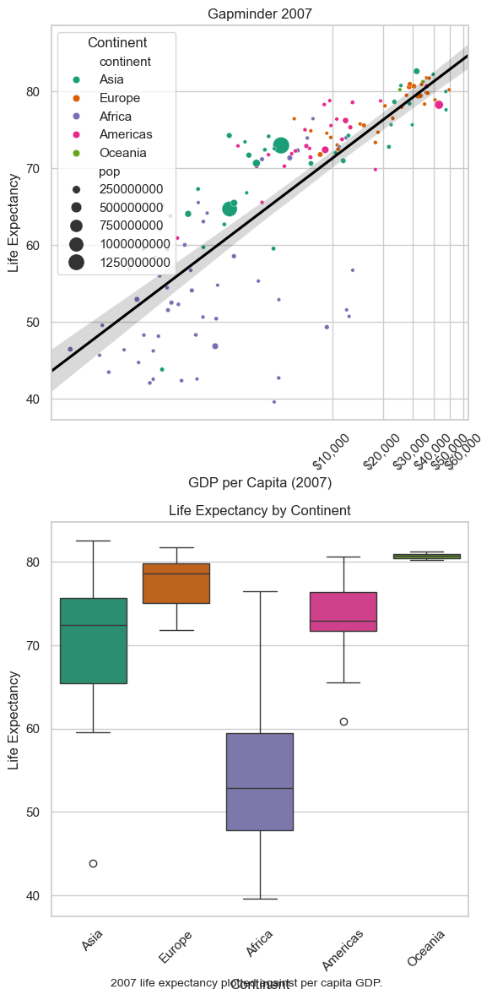

# Building Plots with Matplotlib

Matplotlib in Python is based on a procedural method of building plots – you sequentially add elements to a plot. To construct a graphic using Matplotlib, follow these general steps:

- **Initialize a plot:**
  - Call `plt.figure()` to create a new figure.
  - Call `plt.subplot()` if you need sub-plots.

- **Provide data:**
  - Use pandas or numpy to manage and provide data to Matplotlib functions.

- **Set aesthetic features:**
  - Define aesthetics like markers, colors, and line styles with keyword arguments like `color='blue'`, `linestyle='--'`, etc.

- **Define a plot type:**
  - Use functions like `plt.plot()`, `plt.scatter()`, `plt.bar()`, etc., to set the plot type.

- **Layering additional elements:**
  - Add more elements like error bars, labels, and titles with `plt.errorbar()`, `plt.xlabel()`, `plt.title()`, etc.
  - Overlay plots by calling multiple plot functions in sequence.

- **Adjust scales and legends:**
  - Customize scales with `plt.xlim()`, `plt.ylim()`, and similar functions.
  - Add legends with `plt.legend()`.

- **Final customizations:**
  - Use `plt.style.use()` to set a style.
  - Further customize using `plt.rcParams` or by directly modifying properties of figure and axis objects.

- **Display or save the plot:**
  - Call `plt.show()` to display the plot.
  - Use `plt.savefig()` to save the plot to a file.


# Levels of Measurement & Data Types in Python with Matplotlib

When visualizing data with Matplotlib in Python, it's important to choose the appropriate plot type based on the level of measurement of your data.

| Level    | Order | Description                                        | Example           | Visualization Type                 | Python Data Type |
|----------|-------|----------------------------------------------------|-------------------|------------------------------------|------------------|
| Nominal  | No    | Classifies data into distinct categories.          | Marital Status    | Bar chart, Pie chart               | `object`, `category` |
| Ordinal  | Yes   | Categorizes data with an inherent order.           | Education Level   | Ordered Bar chart, Line plot       | `category` (ordered) |
| Interval | Yes   | Measures differences, not ratios. Zero is not true zero. | Temperature (°C)  | Scatter plot, Line plot            | `int64`, `float64` |
| Ratio    | Yes   | True zero, allowing for meaningful ratios.         | Height, Weight    | Scatter plot, Histogram, Line plot | `int64`, `float64` |

## Visualization Considerations

- Not every plot type is suitable for each level of measurement.
- Ensure that the data types in your `pandas.DataFrame` are correctly specified to visualize your data accurately.


```python
import pandas as pd
import matplotlib.pyplot as plt
import seaborn as sns
```


```python
gapminder = pd.read_csv('https://raw.githubusercontent.com/csc-ubc-okanagan/workshops/a091bc6eae8b9045866c28dbd1848c7e072db5b1/data/gapminder.csv')
gapminder.to_csv('gapminder.csv', index=False)
```


```python
plt.figure(figsize=(10, 6))
```


    <Figure size 1000x600 with 0 Axes>


    <Figure size 1000x600 with 0 Axes>


```python
# Filter the data for the year 2007
gm_2007 = gapminder[gapminder['year'] == 2007]
```


```python
gm_2007.head()
```


<div>
<style scoped>
    .dataframe tbody tr th:only-of-type {
        vertical-align: middle;
    }

    .dataframe tbody tr th {
        vertical-align: top;
    }

    .dataframe thead th {
        text-align: right;
    }
</style>
<table border="1" class="dataframe">
  <thead>
    <tr style="text-align: right;">
      <th></th>
      <th>country</th>
      <th>continent</th>
      <th>year</th>
      <th>lifeExp</th>
      <th>pop</th>
      <th>gdpPercap</th>
    </tr>
  </thead>
  <tbody>
    <tr>
      <th>11</th>
      <td>Afghanistan</td>
      <td>Asia</td>
      <td>2007</td>
      <td>43.828</td>
      <td>31889923</td>
      <td>974.580338</td>
    </tr>
    <tr>
      <th>23</th>
      <td>Albania</td>
      <td>Europe</td>
      <td>2007</td>
      <td>76.423</td>
      <td>3600523</td>
      <td>5937.029526</td>
    </tr>
    <tr>
      <th>35</th>
      <td>Algeria</td>
      <td>Africa</td>
      <td>2007</td>
      <td>72.301</td>
      <td>33333216</td>
      <td>6223.367465</td>
    </tr>
    <tr>
      <th>47</th>
      <td>Angola</td>
      <td>Africa</td>
      <td>2007</td>
      <td>42.731</td>
      <td>12420476</td>
      <td>4797.231267</td>
    </tr>
    <tr>
      <th>59</th>
      <td>Argentina</td>
      <td>Americas</td>
      <td>2007</td>
      <td>75.320</td>
      <td>40301927</td>
      <td>12779.379640</td>
    </tr>
  </tbody>
</table>
</div>


# Creating Scatter plots

```python
sns.scatterplot(
    x=None,
    y=None,
    data=None,
    s=None,
    alpha=None,
    hue=None,
    palette=None,
    style=None
)


- `x`: The data for the x-axis.
- `y`: The data for the y-axis.
- `data`: The DataFrame or data source containing the variables.
- `s`: Specifies the marker size.
- `alpha`: Sets the transparency (opacity) of markers.
- `hue`: Groups data points by a categorical variable and assigns different colors to each group.
- `palette`: Defines the color palette to use for `hue` groups.
- `style`: Groups data points by a categorical variable and assigns different marker styles to each group.


```python
sns.scatterplot(data=gm_2007, x='gdpPercap', y='lifeExp')
```


    <Axes: xlabel='gdpPercap', ylabel='lifeExp'>


```python
# Basic scatter plot
sns.scatterplot(data=gm_2007, x='gdpPercap', y='lifeExp')
plt.xlabel('GDP per Capita (2007)')
plt.ylabel('Life Expectancy')
plt.title('Gapminder 2007: Life Expectancy vs GDP per Capita')
plt.show()
```


# Creating Bar Charts with matplotlib and seaborn

In `matplotlib` and `seaborn`, you can create bar charts similar to `ggplot2`'s `geom_bar()` and `geom_col()`, respectively:

## Creating a Bar Chart with a Count of Categories

To create a bar chart when you have a count of categories (like `geom_bar()` in ggplot2):

- Use `seaborn`'s `countplot` function.
- Pass a categorical variable to the `x` parameter, and it will tally the number of observations associated with each level automatically.
- Customize the plot as needed using `matplotlib` functions.


```python
# Create a bar chart using seaborn (count of categories)
plt.figure(figsize=(8, 6))
sns.countplot(data=gm_2007, x='continent')
plt.xlabel('Continent')
plt.ylabel('Number of Countries')
plt.title('Number of Countries per Continent in 2007')
plt.show()
```


# Creating a Bar Chart with a Tally per Category

To create a bar chart when you have a tally per category (similar to `geom_col()` in ggplot2):

- Use `seaborn`'s `barplot` function.
- Pass a categorical variable to the `x` parameter and a numeric variable to the `y` parameter directly.
- Customize the plot as needed using `matplotlib` functions.


```python
filtered_data = gapminder[gapminder['year'] == 2007]['continent']
country_freqtable = filtered_data.value_counts().reset_index()
country_freqtable.columns = ['continent', 'freq']
country_freqtable
```


<div>
<style scoped>
    .dataframe tbody tr th:only-of-type {
        vertical-align: middle;
    }

    .dataframe tbody tr th {
        vertical-align: top;
    }

    .dataframe thead th {
        text-align: right;
    }
</style>
<table border="1" class="dataframe">
  <thead>
    <tr style="text-align: right;">
      <th></th>
      <th>continent</th>
      <th>freq</th>
    </tr>
  </thead>
  <tbody>
    <tr>
      <th>0</th>
      <td>Africa</td>
      <td>52</td>
    </tr>
    <tr>
      <th>1</th>
      <td>Asia</td>
      <td>33</td>
    </tr>
    <tr>
      <th>2</th>
      <td>Europe</td>
      <td>30</td>
    </tr>
    <tr>
      <th>3</th>
      <td>Americas</td>
      <td>25</td>
    </tr>
    <tr>
      <th>4</th>
      <td>Oceania</td>
      <td>2</td>
    </tr>
  </tbody>
</table>
</div>


```python
# Basic bar chart
plt.figure(figsize=(10, 6))
sns.barplot(x='continent', y='freq', data=country_freqtable)
plt.xlabel('Continent')
plt.ylabel('Frequency')
plt.title('Frequency of Countries per Continent')
plt.show()
```


```python
sns.scatterplot(
    x=None,
    y=None,
    data=None,
    s=None,
    alpha=None,
    hue=None,
    palette=None,
    style=None
)

### Changing Hue, Size and Alpha parameters in scatterplot
- `hue`: Assigns different colors to data points based on a categorical variable, aiding in group distinction.

- `size`: Controls marker size, allowing emphasis or representation of a numeric variable.

- `alpha`: Adjusts marker transparency, managing overlapping points and enhancing visibility.


```python
# Create a scatter plot with color and size mappings
plt.figure(figsize=(10, 8))
sns.scatterplot(x='gdpPercap', y='lifeExp', hue='continent', size='pop', data=gm_2007)
plt.title('Scatter Plot with Color and Size Mappings')
plt.show()
```





- **Unconventional Mappings**: You can perform operations that are grammatically valid but may not always make logical sense, such as mapping size aesthetics to categorical variables.

- **Caution Advised**: However, it's crucial to exercise caution. Unconventional mappings can lead to plots that are challenging to interpret or misleading.


```python
plt.figure(figsize=(10, 8))
sns.scatterplot(x='gdpPercap', y='lifeExp', hue='continent', size='continent', data=gm_2007, sizes=(10, 200))
plt.title('Scatter Plot with Size Mapping to a Categorical Variable')
plt.show()
```





```python
plt.figure(figsize=(10, 8))
sns.scatterplot(x='gdpPercap', y='lifeExp', hue='continent', data=gm_2007, s=100)  # Set 's' for point size
plt.title('Color Mapped to Continent and Uniform Size')
plt.show()
```





### Scales and Labels in Seaborn

### Adjusting Scales

In `seaborn`, you can adjust scales for variables like color, size, and axes. Unlike R's ggplot2, seaborn doesn't use RColorBrewer directly, but it offers various color palettee x-axis
plt.show()


```python
sns.color_palette()
```


<svg  width="550" height="55"><rect x="0" y="0" width="55" height="55" style="fill:#1f77b4;stroke-width:2;stroke:rgb(255,255,255)"/><rect x="55" y="0" width="55" height="55" style="fill:#ff7f0e;stroke-width:2;stroke:rgb(255,255,255)"/><rect x="110" y="0" width="55" height="55" style="fill:#2ca02c;stroke-width:2;stroke:rgb(255,255,255)"/><rect x="165" y="0" width="55" height="55" style="fill:#d62728;stroke-width:2;stroke:rgb(255,255,255)"/><rect x="220" y="0" width="55" height="55" style="fill:#9467bd;stroke-width:2;stroke:rgb(255,255,255)"/><rect x="275" y="0" width="55" height="55" style="fill:#8c564b;stroke-width:2;stroke:rgb(255,255,255)"/><rect x="330" y="0" width="55" height="55" style="fill:#e377c2;stroke-width:2;stroke:rgb(255,255,255)"/><rect x="385" y="0" width="55" height="55" style="fill:#7f7f7f;stroke-width:2;stroke:rgb(255,255,255)"/><rect x="440" y="0" width="55" height="55" style="fill:#bcbd22;stroke-width:2;stroke:rgb(255,255,255)"/><rect x="495" y="0" width="55" height="55" style="fill:#17becf;stroke-width:2;stroke:rgb(255,255,255)"/></svg>


```python
# List the names of available color palettes in Seaborn
palette_names = sns.color_palette().as_hex()

# Print the list of palette names
print(palette_names)
```

    ['#1f77b4', '#ff7f0e', '#2ca02c', '#d62728', '#9467bd', '#8c564b', '#e377c2', '#7f7f7f', '#bcbd22', '#17becf']


## Adjusting Scales
In the following code snippet, we apply a logarithmic transformation to the x-axis variable:


```python
# Create a scatter plot with adjusted scales
plt.figure(figsize=(10, 8))
sns.scatterplot(x='gdpPercap', y='lifeExp', hue='continent', size='pop', data=gm_2007, palette='Dark2', sizes=(10, 200))
plt.xscale('log')  # Apply log transformation to the x-axis
plt.show()
```


## Creating a scatter plot with customized labels, title, and subtitle


```python
# Create a scatter plot with customized labels, title, and subtitle
plt.figure(figsize=(10, 8))
sns.scatterplot(x='gdpPercap', y='lifeExp', hue='continent', size='pop', data=gm_2007,palette='Dark2', sizes=(10, 200))
plt.xscale('log')

# Customize labels and title
plt.xlabel('GDP per Capita (2007)')
plt.ylabel('Life Expectancy')
plt.title('Gapminder 2007')

# Add the subtitle at the bottom of the plot with smaller font size
plt.figtext(0.5, 0.02, '2007 life expectancy plotted against per capita GDP.', fontsize=10, ha='center')

# Display the plot
plt.legend()
plt.show()
```


## Formatting Axis


```python
from matplotlib.ticker import StrMethodFormatter
# Create a scatter plot with Seaborn
plt.figure(figsize=(10, 8))
sns.scatterplot(x='gdpPercap', y='lifeExp', hue='continent', size='pop', data=gm_2007, palette='Dark2', sizes=(10, 200))
plt.xscale('log')

# Customize labels and title
plt.xlabel('GDP per Capita (2007)')
plt.ylabel('Life Expectancy')
plt.title('Gapminder 2007')

# Add the subtitle at the bottom of the plot
plt.figtext(0.5, 0.02, '2007 life expectancy plotted against per capita GDP.', fontsize=10, ha='center')

# Automatically format x-axis ticks as currency (e.g., $10,000)
formatter = StrMethodFormatter('${x:,.0f}')
plt.gca().xaxis.set_major_formatter(formatter)

# Automatically determine x-axis tick intervals
plt.gca().xaxis.set_major_locator(plt.AutoLocator())

# Display the plot
plt.legend()
plt.show()
```


The line `sns.set_theme(style="whitegrid")` in Seaborn is used to set the visual theme for plots. "whitegrid" is one of the built-in themes that configures the plot with a white background and grid lines, creating a clean and minimalistic appearance that helps emphasize the data points.


```python
# Create a scatter plot with Seaborn
plt.figure(figsize=(10, 8))
sns.scatterplot(x='gdpPercap', y='lifeExp', hue='continent', size='pop', data=gm_2007, palette='Dark2', sizes=(10, 200))
plt.xscale('log')

# Customize labels and title
plt.xlabel('GDP per Capita (2007)')
plt.ylabel('Life Expectancy')
plt.title('Gapminder 2007')

# Add the subtitle at the bottom of the plot
plt.figtext(0.5, 0.02, '2007 life expectancy plotted against per capita GDP.', fontsize=10, ha='center')

# Automatically format x-axis ticks as currency (e.g., $10,000)
formatter = plt.FuncFormatter(lambda x, _: '${:,.0f}'.format(x))
plt.gca().xaxis.set_major_formatter(formatter)

# Automatically determine x-axis tick intervals
plt.gca().xaxis.set_major_locator(plt.AutoLocator())

# Display the plot
plt.legend()

sns.set_theme(style="whitegrid")

plt.show()
```


## Customizing the legend position and axis text rotation

Customizing the legend position and axis text rotation, as well as removing minor grid lines, are done at the level of the individual plot functions and not within the theme settings. These customizations are specific to the current plot and affect its appearance and behavior.


```python
# Set Seaborn theme to "whitegrid" (you can choose other themes as well)
#sns.set_theme(style="whitegrid")

# Create a scatter plot with Seaborn
plt.figure(figsize=(10, 8))
sns.scatterplot(x='gdpPercap', y='lifeExp', hue='continent', size='pop', data=gm_2007, palette='Dark2', sizes=(10, 200))
plt.xscale('log')

# Customize labels and title
plt.xlabel('GDP per Capita (2007)')
plt.ylabel('Life Expectancy')
plt.title('Gapminder 2007')

# Add the subtitle at the bottom of the plot
plt.figtext(0.5, 0.02, '2007 life expectancy plotted against per capita GDP.', fontsize=10, ha='center')

# Automatically format x-axis ticks as currency (e.g., $10,000)
formatter = plt.FuncFormatter(lambda x, _: '${:,.0f}'.format(x))
plt.gca().xaxis.set_major_formatter(formatter)

# Automatically determine x-axis tick intervals
plt.gca().xaxis.set_major_locator(plt.AutoLocator())

# Customize the legend position and axis text rotation
plt.legend(loc='upper left')
plt.xticks(rotation=45)  # Rotate x-axis labels by 45 degrees


# Display the plot
plt.show()

```


## Statisical overlays


```python
plt.figure(figsize=(10, 8))
sns.scatterplot(x='gdpPercap', y='lifeExp', hue='continent', size='pop',
                data=gm_2007, palette='Dark2', sizes=(10, 200))
plt.xscale('log')

# Add a linear regression line (overlay)
# Using logx=True to account for the log-scaled x-axis
sns.regplot(x='gdpPercap', y='lifeExp', data=gm_2007, scatter=False,
            logx=True, color='black', truncate=False)

# Customize labels and title
plt.xlabel('GDP per Capita (2007)')
plt.ylabel('Life Expectancy')
plt.title('Gapminder 2007')

# Add the subtitle at the bottom of the plot
plt.figtext(0.5, 0.02, '2007 life expectancy plotted against per capita GDP.', fontsize=10, ha='center')

# Automatically format x-axis ticks as currency (e.g., $10,000)
formatter = plt.FuncFormatter(lambda x, _: f'${x:,.0f}')
plt.gca().xaxis.set_major_formatter(formatter)

# Automatically determine x-axis tick intervals
plt.gca().xaxis.set_major_locator(plt.AutoLocator())

# Customize the legend position and axis text rotation
plt.legend(title='Continent', loc='upper left')
plt.xticks(rotation=45)  # Rotate x-axis labels by 45 degrees

# Remove minor grid lines
plt.grid(axis='y', which='minor', linestyle='--', linewidth=0.5)

# Display the plot
plt.show()
```





```python
gm_2007.info()
```

    <class 'pandas.core.frame.DataFrame'>
    Index: 142 entries, 11 to 1703
    Data columns (total 6 columns):
     #   Column     Non-Null Count  Dtype  
    ---  ------     --------------  -----  
     0   country    142 non-null    object
     1   continent  142 non-null    object
     2   year       142 non-null    int64  
     3   lifeExp    142 non-null    float64
     4   pop        142 non-null    int64  
     5   gdpPercap  142 non-null    float64
    dtypes: float64(2), int64(2), object(2)
    memory usage: 7.8+ KB


## More than one plot: FacetGrid


```python

# Set the aesthetic style of the plots
sns.set_theme(style="whitegrid")

# Create a FacetGrid for different continents
g = sns.FacetGrid(gm_2007, col="continent", hue="continent", col_wrap=3, height=4, palette="Dark2")

# Adding scatter plots for each facet
g.map_dataframe(sns.scatterplot, x="gdpPercap", y="lifeExp")

# Adding regression lines for each facet
g.map(sns.regplot, "gdpPercap", "lifeExp", scatter=False, logx=True, truncate=False, ci=False)

# Customizing each facet
g.set(xscale="log")
g.set_titles("{col_name}")
g.set_axis_labels("GDP per Capita (2007)", "Life Expectancy")

# Customizing x-axis ticks
formatter = plt.FuncFormatter(lambda x, _: f'${x:,.0f}')
for ax in g.axes.flat:
    ax.xaxis.set_major_formatter(formatter)
    ax.xaxis.set_major_locator(plt.FixedLocator([1000, 10000, 100000]))
    ax.tick_params(axis='x', rotation=45)

# Customizing legend for each subplot
for ax in g.axes.flat:
    ax.legend(loc='upper left')

# Adjusting the subplot layout and adding title
g.fig.subplots_adjust(top=0.9)
g.fig.suptitle('Gapminder 2007: Life Expectancy vs GDP per Capita by Continent', fontsize=16)

# Show the plot
plt.show()


```

    /Users/nijiatiabulizi/anaconda3/lib/python3.11/site-packages/seaborn/regression.py:315: RuntimeWarning: invalid value encountered in log
      grid = np.c_[np.ones(len(grid)), np.log(grid)]
    /Users/nijiatiabulizi/anaconda3/lib/python3.11/site-packages/numpy/lib/nanfunctions.py:1577: RuntimeWarning: All-NaN slice encountered
      result = np.apply_along_axis(_nanquantile_1d, axis, a, q,
    /Users/nijiatiabulizi/anaconda3/lib/python3.11/site-packages/seaborn/regression.py:315: RuntimeWarning: invalid value encountered in log
      grid = np.c_[np.ones(len(grid)), np.log(grid)]
    /Users/nijiatiabulizi/anaconda3/lib/python3.11/site-packages/numpy/lib/nanfunctions.py:1577: RuntimeWarning: All-NaN slice encountered
      result = np.apply_along_axis(_nanquantile_1d, axis, a, q,
    /Users/nijiatiabulizi/anaconda3/lib/python3.11/site-packages/seaborn/regression.py:315: RuntimeWarning: invalid value encountered in log
      grid = np.c_[np.ones(len(grid)), np.log(grid)]
    /Users/nijiatiabulizi/anaconda3/lib/python3.11/site-packages/numpy/lib/nanfunctions.py:1577: RuntimeWarning: All-NaN slice encountered
      result = np.apply_along_axis(_nanquantile_1d, axis, a, q,
    /Users/nijiatiabulizi/anaconda3/lib/python3.11/site-packages/seaborn/regression.py:315: RuntimeWarning: invalid value encountered in log
      grid = np.c_[np.ones(len(grid)), np.log(grid)]
    /Users/nijiatiabulizi/anaconda3/lib/python3.11/site-packages/numpy/lib/nanfunctions.py:1577: RuntimeWarning: All-NaN slice encountered
      result = np.apply_along_axis(_nanquantile_1d, axis, a, q,
    /Users/nijiatiabulizi/anaconda3/lib/python3.11/site-packages/seaborn/regression.py:315: RuntimeWarning: invalid value encountered in log
      grid = np.c_[np.ones(len(grid)), np.log(grid)]
    /Users/nijiatiabulizi/anaconda3/lib/python3.11/site-packages/numpy/lib/nanfunctions.py:1577: RuntimeWarning: All-NaN slice encountered
      result = np.apply_along_axis(_nanquantile_1d, axis, a, q,


```python
# Set the aesthetic style of the plots
sns.set_theme(style="whitegrid")

# Create the scatter plot
plt.figure(figsize=(12, 6))
plt.subplot(1, 2, 1)  # 1 row, 2 columns, 1st subplot
sns.scatterplot(x='gdpPercap', y='lifeExp', hue='continent', size='pop',
                data=gm_2007, palette='Dark2', sizes=(10, 200))
plt.xscale('log')

# Add a linear regression line (overlay)
# Using logx=True to account for the log-scaled x-axis
sns.regplot(x='gdpPercap', y='lifeExp', data=gm_2007, scatter=False,
            logx=True, color='black', truncate=False)

# Customize labels and title
plt.xlabel('GDP per Capita (2007)')
plt.ylabel('Life Expectancy')
plt.title('Gapminder 2007')

# Add the subtitle at the bottom of the plot
plt.figtext(0.5, 0.02, '2007 life expectancy plotted against per capita GDP.', fontsize=10, ha='center')

# Automatically format x-axis ticks as currency (e.g., $10,000)
formatter = plt.FuncFormatter(lambda x, _: f'${x:,.0f}')
plt.gca().xaxis.set_major_formatter(formatter)

# Automatically determine x-axis tick intervals
plt.gca().xaxis.set_major_locator(plt.AutoLocator())

# Customize the legend position and axis text rotation
plt.legend(title='Continent', loc='upper left')
plt.xticks(rotation=45)  # Rotate x-axis labels by 45 degrees

# Create the box plot
plt.subplot(1, 2, 2)  # 1 row, 2 columns, 2nd subplot
sns.boxplot(data=gm_2007, x='continent', y='lifeExp', palette='Dark2')
plt.xlabel('Continent')
plt.ylabel('Life Expectancy')
plt.title('Life Expectancy by Continent')
plt.xticks(rotation=45)

# Adjust layout and display the plot
plt.tight_layout()
plt.show()


```

    /var/folders/pk/263cmy6n21j3y3cqybw1dwq40000gn/T/ipykernel_39282/3466973353.py:37: FutureWarning:

    Passing `palette` without assigning `hue` is deprecated and will be removed in v0.14.0. Assign the `x` variable to `hue` and set `legend=False` for the same effect.

      sns.boxplot(data=gm_2007, x='continent', y='lifeExp', palette='Dark2')





```python
# Set the aesthetic style of the plots
sns.set_theme(style="whitegrid")

# Adjust the overall figure size if necessary
plt.figure(figsize=(6, 12))

# Create the scatter plot
plt.subplot(2, 1, 1)  # 2 rows, 1 column, 1st subplot
sns.scatterplot(x='gdpPercap', y='lifeExp', hue='continent', size='pop',
                data=gm_2007, palette='Dark2', sizes=(10, 200))
plt.xscale('log')

# Add a linear regression line (overlay)
# Using logx=True to account for the log-scaled x-axis
sns.regplot(x='gdpPercap', y='lifeExp', data=gm_2007, scatter=False,
            logx=True, color='black', truncate=False)

# Customize labels and title
plt.xlabel('GDP per Capita (2007)')
plt.ylabel('Life Expectancy')
plt.title('Gapminder 2007')

# Add the subtitle at the bottom of the plot
plt.figtext(0.5, 0.02, '2007 life expectancy plotted against per capita GDP.', fontsize=10, ha='center')

# Automatically format x-axis ticks as currency (e.g., $10,000)
formatter = plt.FuncFormatter(lambda x, _: f'${x:,.0f}')
plt.gca().xaxis.set_major_formatter(formatter)

# Automatically determine x-axis tick intervals
plt.gca().xaxis.set_major_locator(plt.AutoLocator())

# Customize the legend position and axis text rotation
plt.legend(title='Continent', loc='upper left')
plt.xticks(rotation=45)  # Rotate x-axis labels by 45 degrees

# Create the box plot
plt.subplot(2, 1, 2)  # 2 rows, 1 column, 2nd subplot
sns.boxplot(data=gm_2007, x='continent', y='lifeExp', palette='Dark2')
plt.xlabel('Continent')
plt.ylabel('Life Expectancy')
plt.title('Life Expectancy by Continent')
plt.xticks(rotation=45)

# Adjust layout and display the plot
plt.tight_layout()
plt.show()


```

    /var/folders/pk/263cmy6n21j3y3cqybw1dwq40000gn/T/ipykernel_39282/1593930546.py:39: FutureWarning:

    Passing `palette` without assigning `hue` is deprecated and will be removed in v0.14.0. Assign the `x` variable to `hue` and set `legend=False` for the same effect.

      sns.boxplot(data=gm_2007, x='continent', y='lifeExp', palette='Dark2')





```python
scatter = sns.scatterplot(data=gm_2007, x='gdpPercap', y='lifeExp', hue='continent', size='pop', sizes=(10, 200), palette='Dark2')
plt.xscale('log')
plt.xlabel('GDP per Capita (2007)')
plt.ylabel('Life Expectancy')
plt.title('Gapminder 2007: Life Expectancy vs GDP per Capita')
plt.xticks(rotation=45)
plt.legend(loc='upper left')

# Define the palette for continents
palette = sns.color_palette("Dark2", n_colors=len(gm_2007['continent'].unique()))

# Add linear regression lines to the scatter plot
for idx, continent in enumerate(gm_2007['continent'].unique()):
    subset = gm_2007[gm_2007['continent'] == continent]
    sns.regplot(x='gdpPercap', y='lifeExp', data=subset, scatter=False, logx=True, color=palette[idx])
```

# Reference

- Python: [Python Software Foundation](https://www.python.org/)
- Pandas: [pandas - Python Data Analysis Library](https://pandas.pydata.org/)
- NumPy: [NumPy - The fundamental package for scientific computing with Python](https://numpy.org/)
- Matplotlib: [Matplotlib - A plotting library for the Python programming language](https://matplotlib.org/)
- Matplotlib cheetsheet: [https://matplotlib.org/cheatsheets/_images/cheatsheets-1.png]


```python

```
