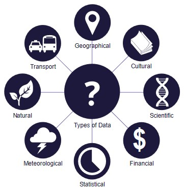
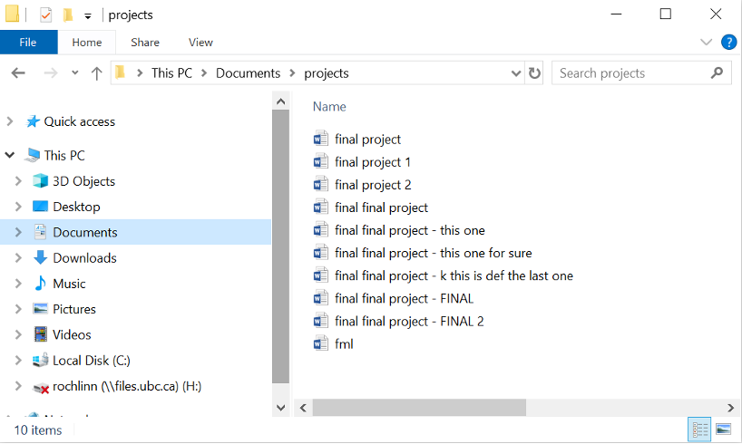
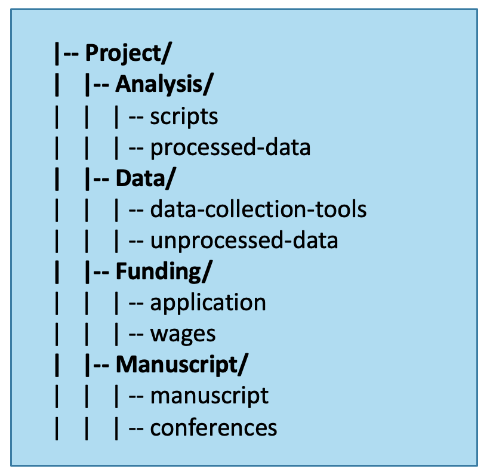
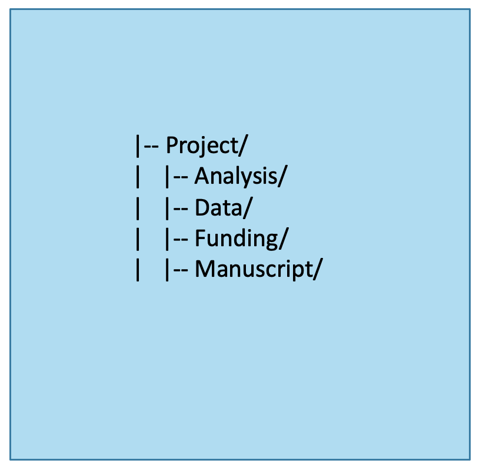
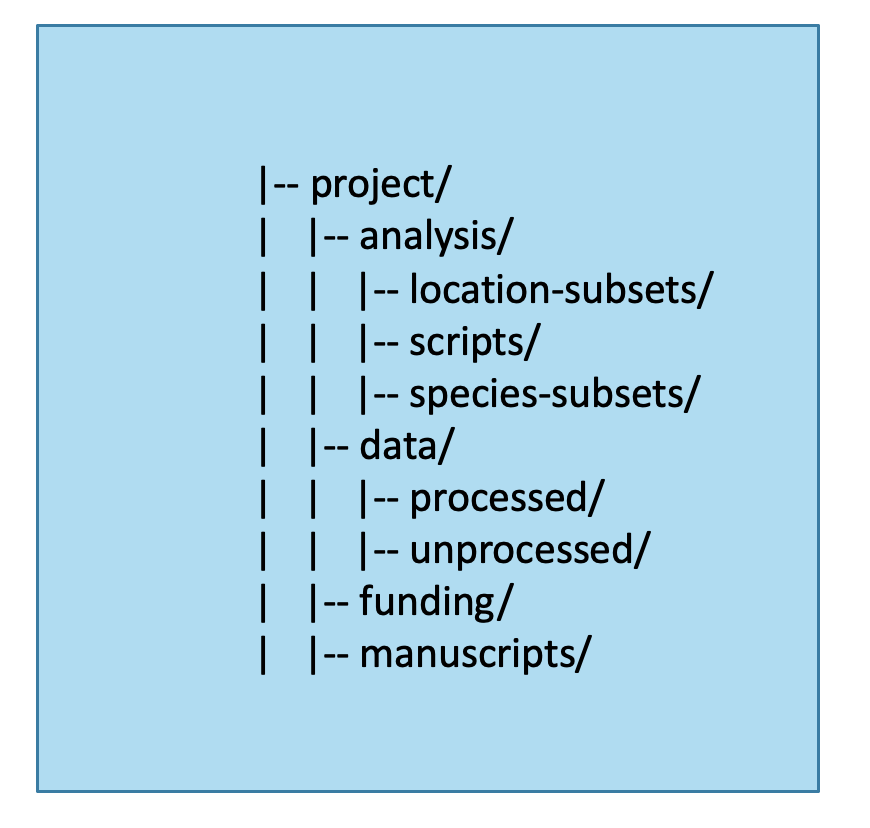

Last Updated: 2023-09-21

## Overview

* What is Research Data? 
* What is Research Data Management (RDM)?
* Why should you care? (Should you?)
* Managing your files
  * File naming
  * Structuring directories

## What is Research Data?

Research data are used as primary sources or evidence to support and validate an inquiry, research question(s), and/or creative work. Research data are distinguished by their intended purpose rather than form and can be experimental, observational, repurposed, processed, or any other manifestation of data. Determining what constitutes research data can be highly contextual and should be decided in keeping with disciplinary norms.

[source](https://en.wikipedia.org/wiki/Data)

## What is Research Data Management (RDM)?

“Research data management (RDM) involves the active organization and maintenance of data throughout the research process, and suitable archiving of the data at the project’s completion. It is an ongoing activity throughout the data life cycle.” [source](https://www.uottawa.ca/library/research-data-management)

### The Research Data Life Cycle

[source](https://alliancecan.ca/en/services/research-data-management)

While this graphic is an oversimplification of what the true process of doing research looks like, it does a good job in conceptualizing the different stages and processes of a research project as it pertains to data.  

**Plan**: This is the stage before your project begins, and can involve putting together ideas that you have for your project, applying for grants, and other logistics that will help you complete your work.  As it pertains to data, this can involved creating a Data Management Plan (DMP), which is a document that outlines how your data will be managed throughout the data life cycle.  For more information about DMPS, see XXXXX (hold for DMP module).

**Create**: This is the stage where your project starts to take shape, and you are creating, collecting, collating, generating (and any other action that represents how your data might come to be!) your data.  

**Process**: After creating data, the next stage involves translating your data into more usable form. This can involve various aspects of cleaning, transforming, reorganizing, filtering, etc. data to prepare it for analysis.

**Analyze**: Once your data has been processed, you can then apply various techniques of analysis to discover meaningful trends or observations in your data, which can then be communicated via a manuscript or other medium. 

**Disseminate**: After your project is complete, you may want to make your data discoverable so that others in your field can find, interpret, and use your data for further studies.  This can be done by depositing your data into a data repository, such as [Borealis](https://borealisdata.ca/dataverse/ubc) or [FRDR](https://www.frdr-dfdr.ca/repo/).

**Preserve**:  Closely aligned with disseminating your data is the idea preservation your data for the long-term (10+ years). While not all data repositories support preservation, both Borealis and FRDR do so by ensuring the data that you deposit will retain its integrity and accessibility.

**Reuse**: While this stage may involve others reusing the data that you shared, this can also bring things full circle where you are reusing someone else's data as you begin your next research project.

## Why should you care? (Should you?)

While it might be hard at first to see the value of RDM (but hopefully you already see it!), there are several benefits to incorporating these data management practices into your research.  

### The FAIR Principles

{width=300px}

[source](https://www.scienceopen.com/collection/70dd374d-6468-4faa-a532-31ebfa37bbd4)

**Findable**: Findable refers to depositing research data and associated materials into a searchable repository, accompanied with rich metadata, so that others can easily discover your work. Having a unique, persistent identifier to ensure that data has a known and stable location is very helpful in ensuring data's findability.  

**Accessible**: Once data is discovered by a user, they will likely want to nkow how to access it.  Access is generally covered in documentation and protocols that indicated how data can be opened (appropriate software or hardware required), if they are restricted, how to get authorized accesss, etc.  While access provisions will be set at the end of a research project, considering future data access is ideally done at the planning stages of a project as it may be impacted by funding requirements, ethics requirements, data sharing agreements, etc.

**Interoperable**: To facilitate data access, interoperability refers to a variety of hardware and software being able to read and interpret the data and metadata.  This boils down to the using standards, controlled languages, and structures that are shared and defined in a precise way.  While a project may have to use a particular software or program with associated file formats, it’s worth identifying at the onset of a project if the format can be converted to a more open format, to allow for the widest use across devices. 

**Reusable**: A large part of data’s reusability comes with accompanying documentation to describe the context under which the data was collected or generated, whether the data is in its original format or if it has been processed, and what processes it has undergone, as well as definitions and explanations of variable names and measurements.  Also referred to as a data sets provenance, documenting data to ensure reusability is something to consider throughout the data lifecycle, and as the project progresses, it’s always good to think about what somebody outside of the project team would need to know to be able interpret the data.  Data reuse also depends on the licenses that are applied to data, stipulating if and how data may be used, and by whom.

More information about the FAIR Principles can be found [here](https://www.go-fair.org/fair-principles/)

### Academic & Data Integrity

A vital objective of RDM is preserving and demonstrating academic integrity, ensuring that others can reproduce, validate, and employ your work. Products of your work will enter the larger body of research that has evolved over generations by building upon preceding research. Your work, in turn, may be used to advance the works of others. Incorporating and building upon others’ data and insights is a fundamental component of research —no matter what form this research may take— and it is founded upon academic integrity. The best way to prove your research’s validity is to ensure that your data is produced and employed consistently and accurately.  

Data integrity refers to preserving the quality, accuracy, and comprehensiveness of your data in all facets of your project and throughout the entire lifecycle of your data. Preserving data integrity is a continuous process that can be undermined by relatively mundane or difficult-to-detect issues, such as inaccurate or incomprehensive data collection, file formatting issues, or simple mistakes like transposition errors. Fostering data integrity through RDM practices will ensure exceptional research results that reflect best practices and intentions outlined in your research design.  

### Tri-Agency RDM Policy

In addition to the benefits to your research, the Tri-Agencies have recently released an [RDM Policy](https://science.gc.ca/site/science/en/interagency-research-funding/policies-and-guidelines/research-data-management/tri-agency-research-data-management-policy) that has requirements for both researchers and research institutions:

**Researcher Requirements**:

* Data Management Plans (DMPS) - a handful of grants have started requiring DMPs with grant applications, and more competitions will adopt this requirement as time goes on.

* Data Deposit - The requirement for research data to be deposited after a project's completion will be coming sometime in the future, based on the readiness of the research community and the supports from their institutions and other national organizations.

**Institutional Requirements**:

* All Tri-Agency eligible institutions were required to publish an institutional RDM Strategy by March 2023, which outlines how RDM will be supported at the institution.  You can find UBC's RDM Strategy [here](https://rdm.ubc.ca/about/ubc-rdm-strategy)

## Managing Files

**File Naming Best Practices**

* Human readable
* Machine readable
* Be consistent!

### Human Readable

* Can you look at a file name and know what it is?  What about in a year from now?
* Will others be able to look at your files and know what they are?

Best practices for human-readable file names:

* Short but complete names
* Ideally 3-5 conceptual elements
* Write down your naming patterns and document them in a README file
* Define acronyms, abbreviations, codes, etc.

Elements to consider in naming files:

* Date of creation/collection
* Short description
* Group/affiliation
* Acvitity
* Location
* Editor/creator
* Other relevant information
:::

### Machine Readable

* How will a computer sort your file names?
* If files move from one computer / application / operating system to another, will they remain interpretable in the same way?

Best practices for machine-readable file names:

* Only contain letters in the Englsih alphabet, numbers 0-9, dashes -, and underscores_
* Do no use spaces or special characters such as:
!@#$%^&*()_=+[]{}|
* Separate naming elements with underscores and dashes

**Examples**

* **Convention**: project_location_collection-date
* **Example**: lldr_mpp_20230723
* **Documentation**:
  * lldr - Leaf Litter Decomposition Rate
  * mpp - Monk Provincial Park

* **Convention**: project_document-type_version_editor
* **Example**: lldr_manuscript_v01_NR
* **Documentation**:
  * lldr - Leaf Litter Decomposition Rate

### Exercise

**Route A**: Take a file name from your computer and make it more human and machine readable

**Route B**: Take one of the file descriptions below and make a human amd machine readable file name

* File 1) An audio recording of an interview with John Bon.  John runs a Vietnamese restaurant in Vancouver called ‘Pho Show!’.  The interview took place on April 3, 2023.

* File 2) A transcribed word document of the audio recorded interview with Jon Bon. 

* File 3) An audio recording of an interview with Jill Dill.  Jill runs a bike rental shop in Montreal called ‘Jill’s Bikes’.  The interview took place on March 31, 2023.

* File 4) A transcribed word document of the audio recorded interview with Jill Dill. 

## Managing Directories

* Directories, AKA your computer's folders, are a way of keeping your files in a clean and easy-to-find fasion
* Developing directory structures before you begin a project can help with managing all the files that will be collected / generated throughout the project
* The same principles for file naming apply to directories

Directory structures typically have:

* A root directory (top-level folder)
* Subdirectories (subfolders)
* Relevant files

{width=300px}

### Hierachy Depth

* A “shallow” directory structure has minimal nesting of folders
* A “deep” structure contains (potentially many) subdirectories
* Choosing which type of structure you want will depend on:
  * How many files your project has
  * The types of files your project has
  * The size of your research team 
  * Personal preference

A shallow directory structure:

{width=300px}

A deep(er) directory structure:

{width=300px}

**Whiteboard a Plan**

* Before jumping into a project, it’s very useful to whiteboard a plan of directories
* It can be helpful to thin about natural and distinct groups of data and files that you’ll be collecting
* To start whiteboarding, think abut:
  * Directory names
  * Directory contents
  * Access permissions
  * Other relevant aspects of the project

### Exercise

**Project context**: You are investigating the post-Covid effects on small businesses in Vancouver, Toronto, and Montreal.  The data from this project will be based on interviews with business owners, including both audio recordings and textual transcriptions, and will look at restaurants, hard goods shops, and services-businesses as separate categories.

Create folder hierarchies (no need to name any files) for this project, using the below file descriptions to get a sense of how you might structure things.

* File 1)	An audio recording of an interview with John Bon.  John runs a Vietnamese restaurant in Vancouver called ‘Pho Show!’.  The 	interview took place on April 3, 2020.

* File 2)	A transcribed word document of the audio recorded interview with Jon Bon.  

* File 3)	An audio recording of an interview with George Gorgeous.  George runs a shoe store in Toronto called ‘step2’.  The interview 	took place on March 30, 2020.

* File 4)	A transcribed word document of the audio recorded interview with George Porridge.  

* File 5)	An audio recording of an interview with Jill Dill.  Jill runs a bike rental shop in Montreal called ‘Jill’s Bikes’.  The interview took 	place on March 31, 2020.

* File 6)	A transcribed word document of the audio recorded interview with Jill Dill.  

