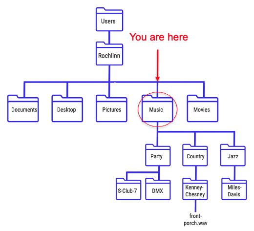
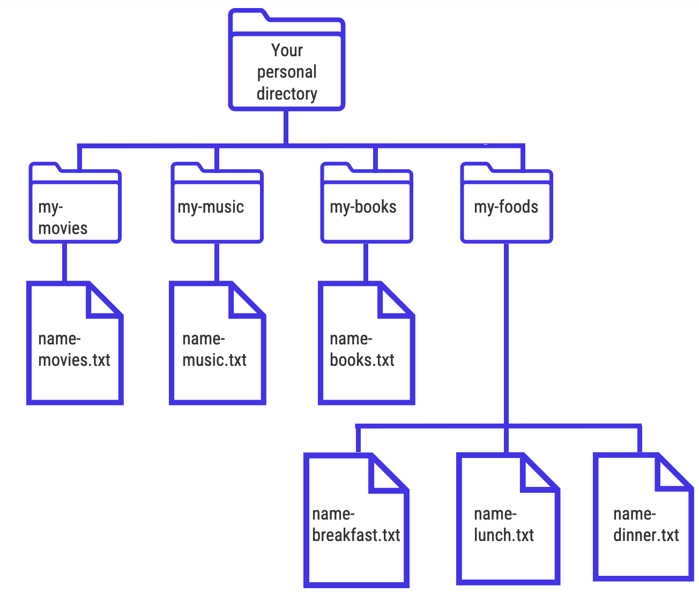

Last Updated: 2023-10-11

## Setup

Before beginning this lesson, you'll need to do a few things:

* 1) Download [shell-lesson-data.zip](https://swcarpentry.github.io/shell-novice/data/shell-lesson-data.zip) and move the file to your desktop
* 2) Unzip/extract the file.  **Let your instructor know if you need help with this step**.  You should end up with a new folder called `shell-lesson-data` on your Desktop.
* 3) If you do not already have the shell software installed, you will need to [download and install it](https://carpentries.github.io/workshop-template/install_instructions/#shell)

## Overview

* Create a directory hierarchy
* Create files in that hierarchy using an editor, and by copying and renaming existing files
* Delete, copy, and move specified files and directories

This session will be geared around building a directory hierarchy, and so we will be following a series of interactive steps exercises as we learn new Unix commands.

### Creating a directory

To begin, move to the `Desktop` directory on your computer.

*`mkdir`
* Make a new directory
* Syntax: mkdir + {directory name}

On your Desktop, create a new personal directory (*choose whatever name you like)

### A quick note on file naming

* Only contain letters in the English alphabet, numbers 0-9, dashes -, and underscores_
* Do no use spaces or special characters such as:
!@#$%^&*()_=+[]{}|
* Separate naming elements with underscores and dashes

After creating this new directory, move from your `Desktop` to the new directory using the `cd` command.

### Creating a text file

Nano is a text editor that can be used to create and edit plain text files via the command line.  When we say 'plain text', it can only work with plain character data, and doesn't work with tables, images, or any other media.  There are many different text editors to choose from, but for the purpose of this lesson, we are going to use Nano because it's one of the least complex.  As you move forward in your Unix journey, feel free to explore and play with different brands of text editors. For the purpose of this lesson, we will be working on .txt files, but there are other plain-text file types that you are also free to explore.

Nano syntax: 

* `nano` (opens text editor)
* `nano + new-file-name` (opens text editor and creates a new file with a specified name)
* `nano + existing-file-name` (opens text editor to an existing file)

### Exercise 1

On your desktop, in your personal directory:

* Create 3 .txt files containing:
  * Your 3 favourite musical artists
  * Your 3 favourite movies
  * Your 3 favourite books
* Name each .txt file as you see fit

## More Unix commands

`touch`

* Creates a file that doesn't have any content
* Syntax: `touch + new-file-name`

`cp`

Copies a file.  There are a few different ways that this command can be used:

* Copy a file to another directory, **keeping the file's name**
* Syntax: `cp {file-path/file-name} + {target-path}`
* Example: To move the song file `front-porch.wav` from the `Country` directory to the `Party` directory:
`cp Country/Kenny-Chesney/front-porch.wav Party`

Starting in the position illustrated in top tree diagram, this command will result in the what's presented the bottom diagram.  Feel free to create this hierarchy on your own machine and play around!

### Exercise 2

* 1. In your personal directory, create a new directory called "music"
* 2. Copy the file with your 3 favourite songs to this new directory, keeping the same file name

---

`cp`

* Copy a file to another directory, **changing the file's name**
* Syntax: `cp {file-path/file-name} + {target-path/new-file-name}`
* Example: To copy the song file `front-porch.wav` from the `Country` directory to the `Party` directory, changing the file name to `fp.wav`:

`cp Country/Kenny-Chesney/front-porch.wav Party/fp.wav`

### Exercise 3

* 1. In your personal directory, create a new directory called "movies"
* 2. Copy the file containing your 3 favourite movies to this new directory, giving the file a new name

---

`cp`

* Copy a file to **the same directory its in**, changing the file's name
* Syntax: `cp {file-path/file-name} + {target-path/new-file-name}`
* Example: To copy the `front-porch.wav` within the `Country` directory (its current directory), changing the name to `fp.wav`:

`cp Country/Kenney-Chesney/front-porch.wav Country/Kenney-Chesney/fp.wav`

---

### Exercise 4

* Copy the file containing your 3 favourite books it is current directory, giving the file a new name.

---

[source](https://tenor.com/en-CA/view/spiderman-faint-smell-danger-gun-oops-gif-8382562)

We're now moving on to commands that are a bit more dangerous than those that have already been discussed, in that once they're executed, there's no way to undo them.  Considering this, always ensure that you've backed up all your important files so you won't have to deal with any unnecessary headaches.

`mv`

Move a file from one destination to another. This command works with the same syntax as the `cp` command, noting that files are being moved rather than being copied.  The one unique function that `mv` offers in that it can be used to change a file's name, using the following pattern:

* Change a file's name, keeping it in the same directory.
* Syntax: `mv {file-name} {new-file-name}`

---

**Exercise 5**

1. In your personal directory, create a new directory called "books"
2. Move one of the files containing your 3 favourite books to this new directory, keeping the same file name

---

The `mv` command can also be used to change a file's name while moving it to a new directory.

* Change a file's name, moving it to a new directory.
* Syntax: `mv {file-path/file-name}{/targer-path/new-file-name}`

---

[source](https://meme-creator.com/meme/146/ralph-in-danger)

Now we're going to move to a command that contains some real danger, in that it will delete a file, with no undo button.  Be cautious with this command, as you won't be able to retrive files that are deleted this way.

`rm`

* Removes a file
* Syntax: `rm {file-name}`

---

In addition to the commands that we've discussed, there are a number of "flags" in Unix that allow us to change the behaviour of a command.  For the purpose of this lesson we'll only be discussing one flag, but for a comprehensive list of Unix flags, see the "Resources" section at the bottom of the page.

`-r` flag

This is called the "recursive" flag, and allows commands to operate on multiple files or whole directories (the previous commands only work on single files on their own).  

To use the `-r` flag, and any other Unix flag, simply place if after a command, and before an argument:

Syntax: `{command} + {-flag} + {directory/files}`

Erase a directory
* Syntax: `rm -r {directory-name}`

Copy a directory
* Syntax: `cp -r {directory-name}`

---

[source](https://www.reddit.com/r/TerrainBuilding/comments/hazxea/update_to_the_parsley_oregano_and_basil_as/)

Moving back to the directory structure you've created on your personal machine, we've made a of a mess!  But that's ok, because it's very common for our files to get messy when working on projects.  With that said, let's finish things up cleaning our files up and putting together a clean structure.

---

**Exercise 8**

1. Create three new .txt files: one that contains your favourite breakfast food, one that contains your favourite lunch food, and one that contains your favourite dinner food.
2. Recreate the following directory structure with the files you've been working with.  The `my-movies`, `my-music`, `my-books`, and `my-foods` directories contain the .txt files of your favourites.

### Resources

* <a href="https://swcarpentry.github.io/shell-novice/">Software Carpentries - The Unix Shell</a>
* <a href="https://cambiotraining.github.io/hpc-intro/99-unix_cheatsheet.html" target="_blank">Unix Cheat Sheet</a>
* <a href="http://www.catb.org/~esr/writings/taoup/html/ch10s05.html" target="_blank">Unix flags</a>

