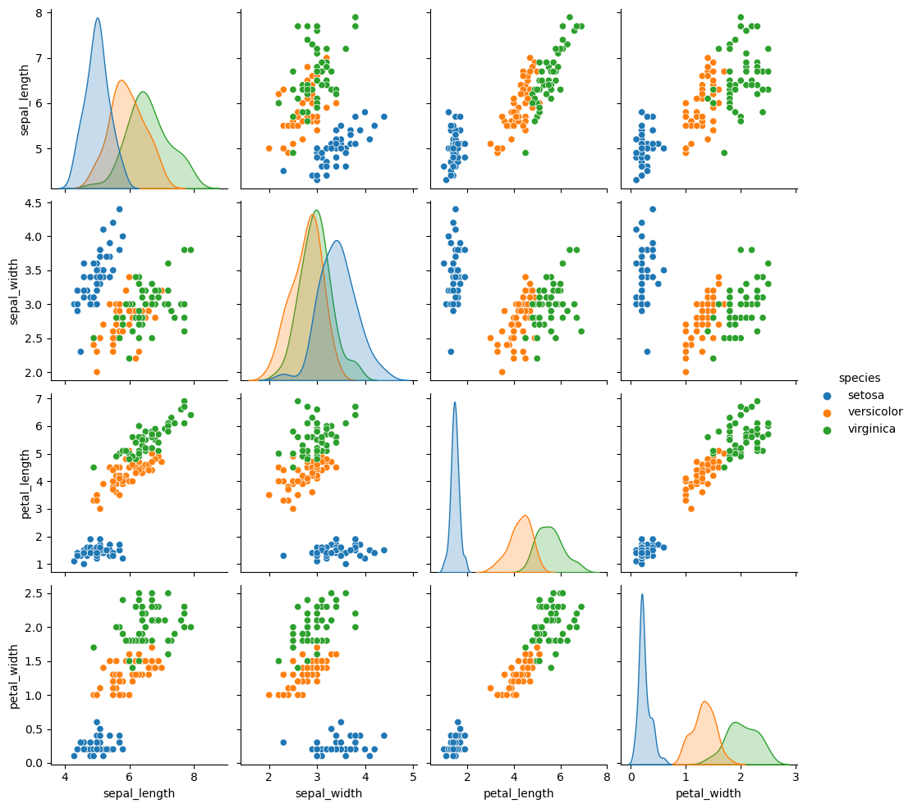
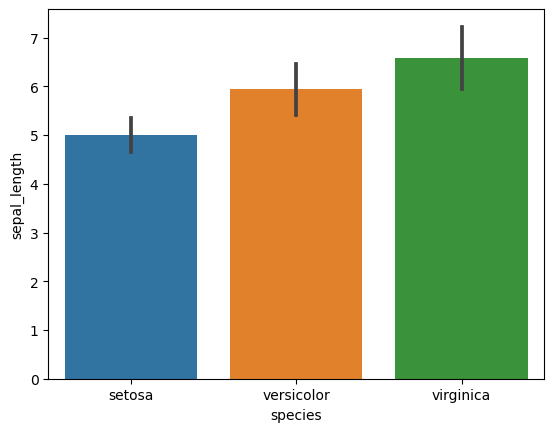
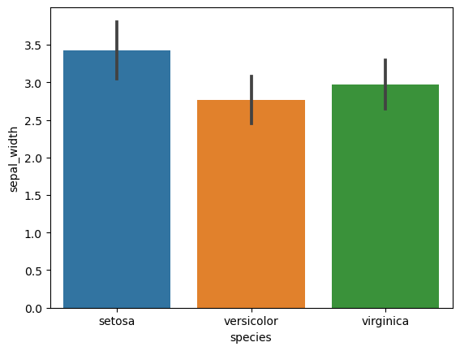
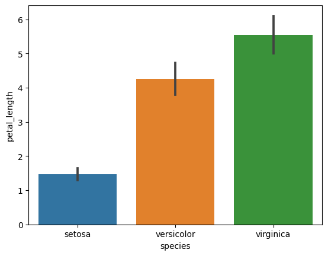
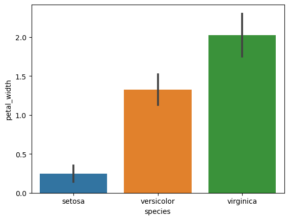
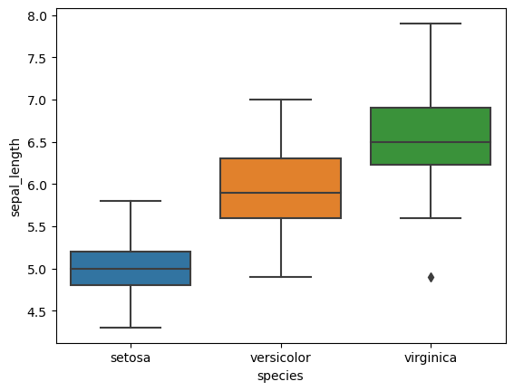
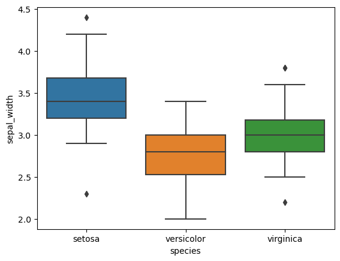
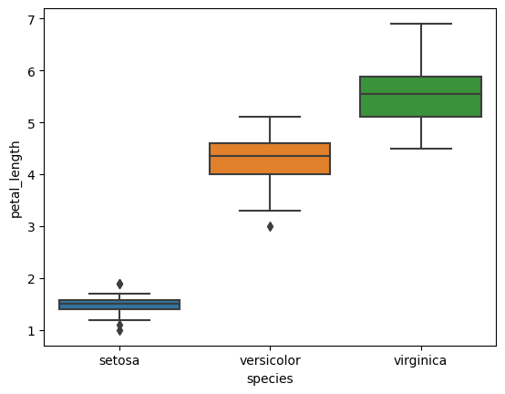
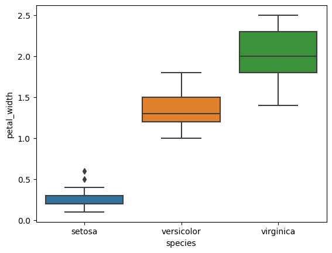
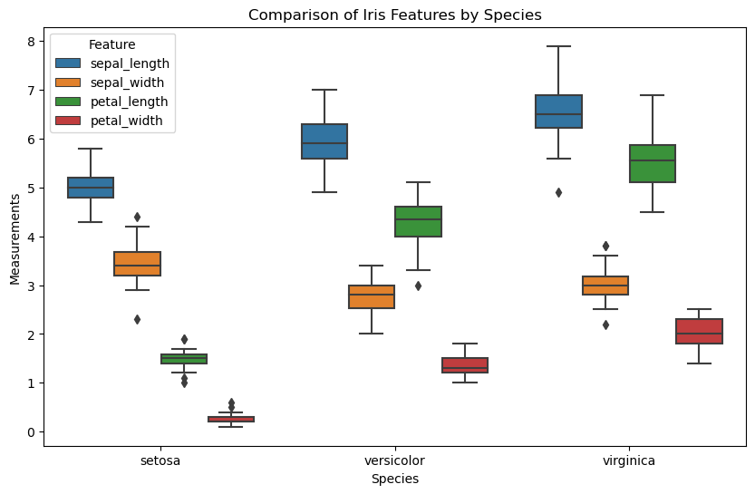

## Data Analysis and Visualization

### 1. Load and Explore the Iris Dataset
- Import necessary libraries: Pandas, Seaborn, and Matplotlib.
- Load the Iris dataset using Seaborn's `load_dataset` function.
- Perform basic exploratory data analysis (EDA) using Pandas to understand the dataset.
  - Display the first few rows of the dataset.
  - Provide summary statistics.
  - Show data types and non-null counts for each column.


```python
import pandas as pd
import seaborn as sns
import matplotlib.pyplot as plt
from scipy import stats

# Load the dataset
iris = sns.load_dataset('iris')

# Basic exploration
print(iris.head())
print(iris.describe())
print(iris.info())

```

       sepal_length  sepal_width  petal_length  petal_width species
    0           5.1          3.5           1.4          0.2  setosa
    1           4.9          3.0           1.4          0.2  setosa
    2           4.7          3.2           1.3          0.2  setosa
    3           4.6          3.1           1.5          0.2  setosa
    4           5.0          3.6           1.4          0.2  setosa
           sepal_length  sepal_width  petal_length  petal_width
    count    150.000000   150.000000    150.000000   150.000000
    mean       5.843333     3.057333      3.758000     1.199333
    std        0.828066     0.435866      1.765298     0.762238
    min        4.300000     2.000000      1.000000     0.100000
    25%        5.100000     2.800000      1.600000     0.300000
    50%        5.800000     3.000000      4.350000     1.300000
    75%        6.400000     3.300000      5.100000     1.800000
    max        7.900000     4.400000      6.900000     2.500000
    <class 'pandas.core.frame.DataFrame'>
    RangeIndex: 150 entries, 0 to 149
    Data columns (total 5 columns):
     #   Column        Non-Null Count  Dtype  
    ---  ------        --------------  -----  
     0   sepal_length  150 non-null    float64
     1   sepal_width   150 non-null    float64
     2   petal_length  150 non-null    float64
     3   petal_width   150 non-null    float64
     4   species       150 non-null    object
    dtypes: float64(4), object(1)
    memory usage: 6.0+ KB
    None


```python
# Count the sample size for each species for each feature
sample_sizes = iris.groupby('species').count()

print(sample_sizes)
```

                sepal_length  sepal_width  petal_length  petal_width
    species                                                         
    setosa                50           50            50           50
    versicolor            50           50            50           50
    virginica             50           50            50           50


### 2. Data Distribution using Histograms
- Plot histograms for each feature of the dataset.
- Set the number of bins to 20 for detailed distribution view.
- Adjust figure size for better visibility.


```python
# Histograms for each feature
iris.hist(bins=20, figsize=(12, 8))
plt.show()
```


### 3. Scatterplots for Variable Relationships
- Use Seaborn's `pairplot` to create pairwise scatterplots.
- Differentiate species with colors (hue parameter).


```python
# Pairwise scatterplots
sns.pairplot(iris, hue='species')
plt.show()
```

    /opt/conda/lib/python3.11/site-packages/seaborn/axisgrid.py:118: UserWarning: The figure layout has changed to tight
      self._figure.tight_layout(*args, **kwargs)





### 4. Bar Plots with Error Bars (Standard Deviation)
- Create bar plots for each numerical feature grouped by species.
- Include error bars showing standard deviation for each group.


```python
# Bar plots with standard deviation
for col in iris.columns[:-1]:
    sns.barplot(x='species', y=col, data=iris, ci='sd')
    plt.show()

```

    /tmp/ipykernel_360/3161031620.py:3: FutureWarning:

    The `ci` parameter is deprecated. Use `errorbar='sd'` for the same effect.

      sns.barplot(x='species', y=col, data=iris, ci='sd')





    /tmp/ipykernel_360/3161031620.py:3: FutureWarning:

    The `ci` parameter is deprecated. Use `errorbar='sd'` for the same effect.

      sns.barplot(x='species', y=col, data=iris, ci='sd')





    /tmp/ipykernel_360/3161031620.py:3: FutureWarning:

    The `ci` parameter is deprecated. Use `errorbar='sd'` for the same effect.

      sns.barplot(x='species', y=col, data=iris, ci='sd')





    /tmp/ipykernel_360/3161031620.py:3: FutureWarning:

    The `ci` parameter is deprecated. Use `errorbar='sd'` for the same effect.

      sns.barplot(x='species', y=col, data=iris, ci='sd')





### 5. Box Plots for Grouped Variables
- Plot box plots for each numerical feature.
- Group data by species to observe statistical summaries across different species.


```python
# Box plots for each feature
for col in iris.columns[:-1]:
    sns.boxplot(x='species', y=col, data=iris)
    plt.show()

```














### 6. Transforming Data Using the `melt` Function for Visualization

- **Purpose**: The `melt` function in pandas is used to transform a DataFrame from a wide format to a long format.
- **Wide to Long Transformation**: It converts columns into rows, often for easier analysis and visualization in long format.
- **Key Parameters**:
  - `id_vars`: Columns to keep as is (identifiers).
  - `value_vars`: Columns to melt down into rows.
  - `var_name`: Name for the new column created from melted column names.
  - `value_name`: Name for the new column created from melted column values.
- **Usage**: `df.melt(id_vars, value_vars, var_name, value_name)`
- **Result**: Outputs a DataFrame in long format where each row represents a single observation for a variable, facilitating easier data manipulation and plotting.


```python
# Melt the dataframe for easier plotting
iris_melted = iris.melt(id_vars='species', var_name='feature', value_name='value')
iris_melted
```


<div>
<style scoped>
    .dataframe tbody tr th:only-of-type {
        vertical-align: middle;
    }

    .dataframe tbody tr th {
        vertical-align: top;
    }

    .dataframe thead th {
        text-align: right;
    }
</style>
<table border="1" class="dataframe">
  <thead>
    <tr style="text-align: right;">
      <th></th>
      <th>species</th>
      <th>feature</th>
      <th>value</th>
    </tr>
  </thead>
  <tbody>
    <tr>
      <th>0</th>
      <td>setosa</td>
      <td>sepal_length</td>
      <td>5.1</td>
    </tr>
    <tr>
      <th>1</th>
      <td>setosa</td>
      <td>sepal_length</td>
      <td>4.9</td>
    </tr>
    <tr>
      <th>2</th>
      <td>setosa</td>
      <td>sepal_length</td>
      <td>4.7</td>
    </tr>
    <tr>
      <th>3</th>
      <td>setosa</td>
      <td>sepal_length</td>
      <td>4.6</td>
    </tr>
    <tr>
      <th>4</th>
      <td>setosa</td>
      <td>sepal_length</td>
      <td>5.0</td>
    </tr>
    <tr>
      <th>...</th>
      <td>...</td>
      <td>...</td>
      <td>...</td>
    </tr>
    <tr>
      <th>595</th>
      <td>virginica</td>
      <td>petal_width</td>
      <td>2.3</td>
    </tr>
    <tr>
      <th>596</th>
      <td>virginica</td>
      <td>petal_width</td>
      <td>1.9</td>
    </tr>
    <tr>
      <th>597</th>
      <td>virginica</td>
      <td>petal_width</td>
      <td>2.0</td>
    </tr>
    <tr>
      <th>598</th>
      <td>virginica</td>
      <td>petal_width</td>
      <td>2.3</td>
    </tr>
    <tr>
      <th>599</th>
      <td>virginica</td>
      <td>petal_width</td>
      <td>1.8</td>
    </tr>
  </tbody>
</table>
<p>600 rows × 3 columns</p>
</div>


```python
# Create the bar plot
plt.figure(figsize=(10, 6))
sns.barplot(data=iris_melted, x='species', y='value', hue='feature', ci='sd')

# Adding labels and title
plt.xlabel('Species')
plt.ylabel('Measurements')
plt.title('Comparison of Iris Features by Species')
plt.legend(title='Feature')

# Show the plot
plt.show()
```

    /tmp/ipykernel_360/1227743032.py:3: FutureWarning:

    The `ci` parameter is deprecated. Use `errorbar='sd'` for the same effect.

      sns.barplot(data=iris_melted, x='species', y='value', hue='feature', ci='sd')


```python
# Create the box plot
plt.figure(figsize=(10, 6))
sns.boxplot(data=iris_melted, x='species', y='value', hue='feature')

# Adding labels and title
plt.xlabel('Species')
plt.ylabel('Measurements')
plt.title('Comparison of Iris Features by Species')
plt.legend(title='Feature')

# Show the plot
plt.show()
```





### 7. Inferential Statistical Test

#### Comparing Two Groups

#### Assumptions for Conducting a T-test

- **Normality**: Data should follow a normal distribution.
- **Independence**: Samples must be independent of each other.
- **Homogeneity of Variances**: Equal variances across groups (for two-sample T-test).
- **Measurement Scale**: Data should be on an interval or ratio scale.
- **Random Sampling**: Data collection should be based on random sampling.


```python
# Separating the data
species1 = iris[iris['species'] == 'setosa']['sepal_width']
species2 = iris[iris['species'] == 'versicolor']['sepal_width']

# Normality Test (Shapiro-Wilk)
shapiro_test_species1 = stats.shapiro(species1)
shapiro_test_species2 = stats.shapiro(species2)

print("Shapiro-Wilk Test for Setosa: Statistic =", shapiro_test_species1.statistic, ", P-value =", shapiro_test_species1.pvalue)
print("Shapiro-Wilk Test for Versicolor: Statistic =", shapiro_test_species2.statistic, ", P-value =", shapiro_test_species2.pvalue)

# Homogeneity of Variance Test (Levene's Test)
levene_test = stats.levene(species1, species2)

print("Levene's Test: Statistic =", levene_test.statistic, ", P-value =", levene_test.pvalue)
```

    Shapiro-Wilk Test for Setosa: Statistic = 0.971718966960907 , P-value = 0.2715126574039459
    Shapiro-Wilk Test for Versicolor: Statistic = 0.9741329550743103 , P-value = 0.3379843533039093
    Levene's Test: Statistic = 0.591002044989776 , P-value = 0.44388064024686136


The Shapiro-Wilk tests for both Setosa and Versicolor species show p-values of 0.2715 and 0.3380, respectively, which are greater than the common alpha level of 0.05. This suggests that the sepal width distributions for both species are consistent with normality. Additionally, Levene's test yields a p-value of 0.4439, indicating no significant difference in the variances of sepal width between Setosa and Versicolor. Therefore, the assumptions of normality and homogeneity of variances for a T-test are satisfied in this case.


```python
# Two-sample T-test
t_stat, p_val = stats.ttest_ind(species1, species2)
print("T-statistic:", t_stat)
print("P-value:", p_val)

```

    T-statistic: 9.454975848128596
    P-value: 1.8452599454769322e-15


This indicates a significant difference in sepal widths between these species, with the extremely low P-value strongly confirming the statistical significance of this difference.

#### Comparing More than Two Groups

#### Assumptions for Conducting ANOVA in R

ANOVA (Analysis of Variance) is a widely used statistical method, and several key assumptions must be met for valid results:

1. **Normality**: The residuals of the groups should be normally distributed.
2. **Homogeneity of Variances**: The variances among the groups should be approximately equal.
3. **Independence**: Observations must be independent within and across groups.
4. **Random Sampling**: The data should be collected randomly from the population.
5. **Measurement Scale**: The dependent variable should be measured at least at the interval level.


```python
import statsmodels.api as sm
from statsmodels.formula.api import ols
from statsmodels.stats.multicomp import pairwise_tukeyhsd
```


```python
# Separate 'sepal_width' for each species
setosa_sw = iris[iris['species'] == 'setosa']['sepal_width']
versicolor_sw = iris[iris['species'] == 'versicolor']['sepal_width']
virginica_sw = iris[iris['species'] == 'virginica']['sepal_width']

# Normality Test (Shapiro-Wilk)
print("Shapiro-Wilk Test (Setosa):", stats.shapiro(setosa_sw))
print("Shapiro-Wilk Test (Versicolor):", stats.shapiro(versicolor_sw))
print("Shapiro-Wilk Test (Virginica):", stats.shapiro(virginica_sw))

# Homogeneity of Variance Test (Levene's Test)
print("Levene's Test:", stats.levene(setosa_sw, versicolor_sw, virginica_sw))
```

    Shapiro-Wilk Test (Setosa): ShapiroResult(statistic=0.971718966960907, pvalue=0.2715126574039459)
    Shapiro-Wilk Test (Versicolor): ShapiroResult(statistic=0.9741329550743103, pvalue=0.3379843533039093)
    Shapiro-Wilk Test (Virginica): ShapiroResult(statistic=0.9673907160758972, pvalue=0.18089871108531952)
    Levene's Test: LeveneResult(statistic=0.5902115655853319, pvalue=0.5555178984739075)


The results of the Shapiro-Wilk tests for Setosa, Versicolor, and Virginica show p-values of 0.2715, 0.3380, and 0.1809, respectively. These values are all above the common alpha level of 0.05, suggesting that the 'sepal width' data for each species are consistent with a normal distribution. Additionally, Levene's test results in a p-value of 0.5555, indicating no significant difference in the variances of 'sepal width' among the three species. Therefore, both the normality and homogeneity of variances assumptions for conducting ANOVA are met in this case.


```python
# Perform one-way ANOVA on sepal width across species
f_statistic, p_value = stats.f_oneway(iris[iris['species'] == 'setosa']['sepal_width'],
                                      iris[iris['species'] == 'versicolor']['sepal_width'],
                                      iris[iris['species'] == 'virginica']['sepal_width'])

print("F-statistic:", f_statistic)
print("P-value:", p_value)
```

    F-statistic: 49.160040089612075
    P-value: 4.492017133309115e-17


A low p-value (usually <0.05) would indicate that there is a statistically significant difference in sepal width among at least two of the species.


```python
import statsmodels.stats.multicomp as multi

# Assuming ANOVA has been performed and shows significant results

# Perform Tukey's HSD test
tukey_hsd = multi.pairwise_tukeyhsd(endog=iris['sepal_width'], groups=iris['species'], alpha=0.05)

# Print the results
print(tukey_hsd)

```

        Multiple Comparison of Means - Tukey HSD, FWER=0.05     
    ============================================================
      group1     group2   meandiff p-adj   lower   upper  reject
    ------------------------------------------------------------
        setosa versicolor   -0.658    0.0 -0.8189 -0.4971   True
        setosa  virginica   -0.454    0.0 -0.6149 -0.2931   True
    versicolor  virginica    0.204 0.0088  0.0431  0.3649   True
    ------------------------------------------------------------


## Tukey HSD Test Results - Iris Dataset Sepal Width

- **Setosa vs. Versicolor**:
  - Mean difference: -0.658
  - P-value: < 0.05
  - Significant difference: Yes

- **Setosa vs. Virginica**:
  - Mean difference: -0.454
  - P-value: < 0.05
  - Significant difference: Yes

- **Versicolor vs. Virginica**:
  - Mean difference: 0.204
  - P-value: < 0.05
  - Significant difference: Yes


```python

```
